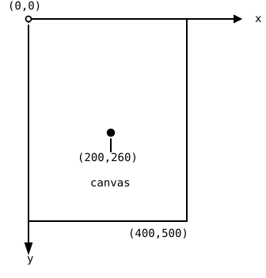

By the end of this chapter you'll have written your very first real program and watched a small arrangement of shapes appear on the canvas in front of you. You'll get there by typing the code exactly as it's given, one character at a time, and seeing for yourself how a program comes to life. It's a small result, but it's entirely yours, and it's the moment programming stops being an idea and starts being something you do.

## AI tutor {#sec-tutor-first-program}

Your first program has to be typed exactly right, so small mistakes are part of
the deal. When the playground shows an error message you can't make sense of,
the AI tutor of this part helps you read it.



## Where you'll write code {#sec-playground}

Professional developers write code in powerful programs like Visual Studio
Code. Tools like that are great, but before you can even start, you have to
install them, add extensions, download dependencies, and configure many
settings. That's a lot of setup before the first line of code.

In this course you'll skip all of that. You'll write your code in a simple
**web playground** that runs in your browser. There's nothing to install:
you open a link, and you're ready to program. The playground guides you
through structured exercises. For each exercise you see a description of your
task, an editor where you type your code, and a preview area where your
program runs and shows its result.

## Every keystroke matters {#sec-exactness}

Here's the most important lesson of your first exercise, and maybe of the
whole course: **computers take you literally**. A computer doesn't guess what
you meant. It does exactly what your code says, character by character.

For a computer, these two lines are completely different:

```typescript
circle(200, 260, 360);
Circle(200, 260, 360);
```

The first one draws a circle. The second one is an error, because the command
is called `circle` with a lowercase `c`, and `Circle` with an uppercase `C`
is a name the computer doesn't know. One single letter decides whether your
program works.

The same is true for every parenthesis `(`, every comma, every semicolon `;`,
and especially every curly brace `{` and `}`. Curly braces always come in
pairs: every opening `{` needs a closing `}`. Forget one, and the computer
gets confused about where your code begins and ends.

This exactness can feel strict at first. But it's also good news: there is no
hidden magic. If your code is exact, it works, every time, for everyone.

::: {.callout-important}
## Semicolons are mandatory

TypeScript itself doesn't force you to end every statement with a semicolon:
code without them still runs. In this course, semicolons are mandatory
anyway: **every statement ends with a `;`**.

There's a good reason for this rule. In later courses you'll meet
programming languages like C, Java, and C#, and they all require the
semicolon after every statement. If your fingers learn the habit now, those
languages will feel familiar from day one.
:::

## A program is a sequence of statements {#sec-sequence}

A program is built from **statements**. A statement is one instruction to the
computer, like "create a drawing canvas" or "draw a line". In your code, you
write one statement per line, and each statement ends with a semicolon `;`.

The computer runs your statements **in order, from top to bottom**, like
steps in a recipe. The order matters. For example, a statement like
`background("pink")` paints the whole canvas pink. If you draw a circle
first and paint the background afterwards, the pink paint covers your
circle, and you'll see an empty pink canvas.

::: {.callout-important}
## The canvas: your sheet of paper

In p5.js, you draw on a **canvas**. Think of it as a sheet of paper lying on
your desk: the statement `createCanvas(400, 500)` puts a sheet on the screen
that is 400 pixels wide and 500 pixels tall, and every drawing command after
it draws on that sheet.

To tell a command *where* to draw, the canvas uses a coordinate system. You
know coordinate systems from math class, but the canvas has one important
difference: the origin (0, 0) is in the **top left corner** of the canvas.

- The **x axis** works as you expect: higher x values go to the **right**.
- The **y axis** is flipped: higher y values go **down**, not up.

{width=320}

So the point (200, 260) lies 200 pixels to the right of the left edge and
260 pixels down from the top edge. The flipped y axis surprises almost every
beginner, so keep it in mind when a shape doesn't appear where you expected.
:::

In your first exercise, the statements are **drawing commands** from the
p5.js library. Each command has a name and, in parentheses, a list of
**parameters**: values that tell the command what exactly to do. For example:

```typescript
circle(200, 260, 360);
```

This statement draws a circle. The three parameters are the position of the
circle's center (200 across, 260 down) and its diameter (360). Change the
numbers, and the circle moves or grows. You'll explore what each parameter
means while you play with the code.

## Red squiggly lines show you your mistakes {#sec-squiggles}

While you type, the editor constantly checks your code. When something is
wrong, a mistyped name, a missing parenthesis, a lost curly brace, it
underlines the problem with a **red squiggly line**, just like a spell
checker underlines a typo in a text document.

When you see a red squiggle:

1. Don't panic. Squiggles are completely normal. Every programmer, including
   professionals, sees them all day long.
2. Move your mouse over the underlined code. A small message appears that
   describes the problem.
3. Compare your code with the example, character by character. Fix the
   difference, and the squiggle disappears.

Making mistakes is not failing, it's how programming works. You type, the
editor points at a problem, you fix it, and you move on. You'll get faster at
this with every exercise.

## Format your code properly {#sec-formatting}

Code isn't only for computers, it's also for people: for you next week, for
your classmates, and for your teacher. That's why programmers format their
code carefully:

- **Indentation:** statements inside curly braces are shifted to the right by
  a fixed number of spaces. That makes it easy to see what belongs together.
- **One statement per line:** don't squeeze several statements into one line.
- **Consistent spacing:** for example, one space after each comma.

In the exercise, copy the formatting exactly as you see it in the example,
including the spaces at the beginning of the lines. Well-formatted code is
much easier to read, and mistakes like a missing curly brace are much easier
to find.

## Your first exercise: Shapes {#sec-shapes}

Now you're ready. Open the **Shapes** exercise in the web playground. Your
task there has two parts:

1. **Type the code** from the example, exactly as shown. Every character
   counts: uppercase and lowercase letters, parentheses, commas, semicolons,
   curly braces, and spaces. Take your time. Typing code is a skill of its
   own, and speed comes later. Lines that start with `//` are comments,
   notes for human readers that the computer ignores. Type them in too, as
   typing practice. A typo in a comment is harmless.
2. **Play with the code.** When your program runs, change the parameters of
   the drawing commands and watch what happens. Move the circle, stretch the
   rectangle, try other colors. If you hover your mouse over a command name,
   a small tooltip shows you its documentation.

If your canvas stays empty or a red squiggle won't go away, compare your code
with the example line by line. The difference is always there, even when it's
just one character. Finding it is part of the exercise.



## Check your understanding {#sec-quiz}

When you've finished the exercise, take the short quiz below. You answer
eight questions about this chapter in your own words, and an AI reads your
answers and tells you what you already understand and what you should read
again. The quiz is anonymous, and answering in German is fine too.


