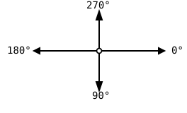

{width=360}

This chapter adds a new shape to your kit: a piece of a circle. You'll use it to draw a cheerful smiley face grinning out from the middle of the canvas, its two eyes simple shapes you already know and its mouth a real curved smile, a single slice of a circle rather than a full one. That curve is the piece you couldn't draw before.

Rectangles, circles, triangles, and lines got you a long way: a house, a
cat, the Olympic rings. But some pictures need a shape you can't build from
those: a *part* of a circle. Think of a smiling mouth. It's not a full
circle, it's just the lower piece of one. In p5.js, that shape is called an
**arc**, and it comes with a new command: `arc`.

In this exercise you'll type in a given program again, exactly as it's
shown, like you did in the very first exercise. It draws a smiley face, and
its mouth is an arc. Typing first and experimenting afterwards is on
purpose: `arc` is the trickiest command you've met so far, and the best way
to understand it is to see it work and then start turning its knobs.

## The arc command {#sec-arc}

`arc` takes six parameters. The first four are like an ellipse: the x and y
of the center, then the width and the height. The last two are new: the
**start angle** and the **end angle**. They say where on the outline the
visible piece begins and where it ends.

```typescript
//  +---------------------------- x coordinate of the center
//  |    +----------------------- y coordinate of the center
//  |    |    +------------------ width
//  |    |    |    +------------- height
//  |    |    |    |    +-------- start angle
//  |    |    |    |    |   +---- end angle
//  v    v    v    v    v   v
arc(200, 250, 200, 150, 25, 180);
```

Because width and height are separate, an arc doesn't have to be part of a
perfect circle. Make the height smaller than the width, and you get a piece
of a flattened circle, an ellipse. That's exactly what makes the smiley's
mouth look like a relaxed smile instead of a half circle.

{width=440}

## Angles on the canvas {#sec-angles}

Out of the box, p5.js measures angles in **radians**, a unit you'll meet in
math class in a few years. The statement `angleMode(DEGREES)` at the top of
the program switches p5.js to degrees, the unit you already know: a full
circle is 360°.

Where do the angles point? On the canvas, 0° points to the right, and from
there the angle grows **clockwise**:

{width=280}

In math class, angles grow counterclockwise, so 90° would point up. On the
canvas it's the other way around, and the reason is an old friend: the
y axis points down. The smiley's mouth shows what that means in practice:
`arc(200, 250, 200, 150, 25, 180)` starts at 25° (a little below the
3 o'clock position) and runs clockwise through 90° (the bottom) to 180°
(the 9 o'clock position). The visible piece is the lower part of the
outline: a smile.

## Learn commands by experimenting {#sec-experiment}

Understanding the parameters of `arc` from a description alone is hard.
Nobody does it that way, professionals included. The way to really
understand a command like this is to experiment with it:

1. Type in the program and run it, so you have a working starting point.
2. Change **one parameter at a time**, run again, and watch what happens.
   What does a start angle of 0 do? An end angle of 270? A height of 300?
3. If the result gets confusing, `Ctrl` + `Z` takes you back to the last
   working state.

Changing one thing at a time is the important part. If you change three
numbers at once and the picture jumps, you can't tell which change did
what. One change, one run, one observation: that's how programmers explore
every unfamiliar command, and it never stops being useful.

And remember the tooltips: hover your mouse over `arc` in the editor, and
the playground shows you the documentation of the command, including the
list of its parameters.

## Your exercise: Smiley face {#sec-smiley}

Open the **Smilie Face (Arcs)** exercise in the web playground and type in
the program, exactly as shown, every character. Run it and enjoy your
smiley. Then take the time to play with the parameters of `arc` until the
command feels familiar: make the smile wider, flatter, upside down, or turn
the mouth into a surprised little "o".

The arc knowledge you build here is not just for smileys. In the next
exercise, arcs are the key to a puzzle that full circles can't solve:
weaving the Olympic rings together properly.



## Check your understanding {#sec-quiz-arcs}

When you've finished the exercise, take the short quiz below. You answer
five questions about this chapter in your own words, and an AI reads your
answers and tells you what you already understand and what you should read
again. The quiz is anonymous, and answering in German is fine too.


