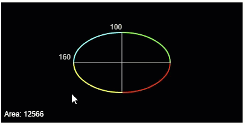
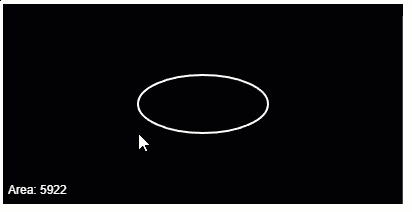
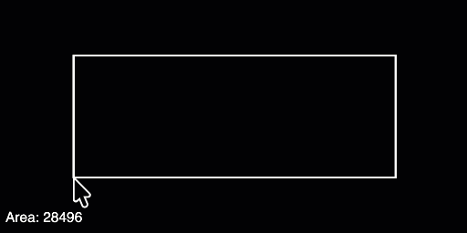
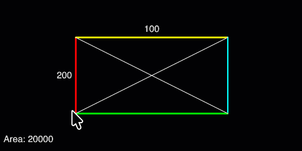

{width=380}

This part closes the way the last one did: with practice projects written
as job briefings. Imagine you are part of a team building a graphical
design application, and your job is to implement two drawing tools, one
for ellipses and one for rectangles. Between them, the two tools use
almost everything from this part: mouse events, the system variables
`width` and `height`, constants with explicit types, the snapping
formula, template strings, and text output.

Take these projects seriously. They are practice for exactly the kind of
task you'll get in an assessment. Plan on paper, work in small steps, and
hand in formatted code, just as you've learned.

## AI tutor {#sec-tutor-drawing-tools}

Both drawing tools are practice for an assessment, so work on them on your own
first and turn to the AI tutor of this part when you're really stuck. It gives
you the next hint, never the finished tool.



## The briefing: a circle tool {#sec-circle-tool}

The circle tool lets the user shape an ellipse with the mouse. The basic
version has three requirements:

1. **A centered ellipse.** While the user moves the mouse, an ellipse
   appears, centered on the canvas. The centering must be responsive: if
   someone changes the parameters of `createCanvas`, the ellipse stays
   centered without any other change to the code.
2. **The mouse controls the size.** The width of the ellipse is the
   distance between `mouseX` and the canvas center, multiplied by two.
   The height works the same way with `mouseY`. So the further the mouse
   moves away from the center, the larger the ellipse grows.
3. **The area in the corner.** The lower left corner shows the area of
   the ellipse in the format `Area: 123`, as a whole number. The area of
   an ellipse is the horizontal radius times the vertical radius times $\pi$.

{width=380}

## Three helpers you haven't met {#sec-tool-helpers}

Three small pieces are new; everything else in the briefing is knowledge
you already have.

**`ellipse` draws stretched circles.** The command `circle(x, y, d)` can
only draw perfect circles, because it has a single diameter. Its bigger
sibling `ellipse(x, y, w, h)` takes the center position plus a width and
a height of their own, and that is exactly what the tool needs.

**`abs` removes the minus sign.** Requirement 2 talks about the
*distance* between `mouseX` and the center. The obvious formula,
`mouseX - width / 2`, gives a negative number whenever the mouse is left
of the center, and a width of -140 makes no sense. The helper function
`abs` returns the absolute value of a number: `abs(-70)` is 70, and
`abs(70)` is also 70. It belongs to the same family of calculating
functions as `round` and `min`: it draws nothing, it computes something
for you.

**`PI` is $\pi$, ready to use.** For the area you need $\pi$, and p5.js provides
it as the constant `PI`, holding 3.14159 and so on. You write it without
parentheses, because it's a value, not a function. Since $\pi$ has endless
decimal places, the computed area has them too; wrap the calculation in
`round` so the corner shows `Area: 12566` and not a number with a long
tail.

## The polished circle tool {#sec-circle-tool-polish}

When the basic tool works, the briefing has four upgrades. Each one is a
separate step; finish and test one before starting the next.

1. **Helper lines.** Draw a horizontal and a vertical line through the
   center of the ellipse, dividing it into four equal quadrants.
2. **Snap to grid.** The two diameters must snap to a grid of 20 pixels,
   so the width and height are always multiples of 20. That is the
   snapping formula from the snapping chapter, applied to a size instead
   of a position: divide by 20, round, multiply by 20.
3. **Diameter labels.** Show the horizontal diameter as a number directly
   left of the ellipse's center line, and the vertical diameter above the
   ellipse's top center. One tip for the horizontal label: normally a
   text *starts* at the position you give; after `textAlign(RIGHT)`, it
   *ends* there, which is exactly right for a label that should sit left
   of a point.
4. **Colored quadrants.** Draw the outline of each quadrant in its own
   color. A quadrant's outline is an arc of 90 degrees, and `arc` together
   with `angleMode(DEGREES)` is smiley knowledge; the starter code already
   switches the angle mode for you. Remember `noFill` and `strokeWeight`
   from the Olympic rings for outline-only drawing.

## How to work, and when to peek {#sec-when-to-peek}

Work the way you've practiced all through this part:

1. **Paper first.** The canvas is 400 by 200, so its center is (200, 100).
   Complete the table below by hand before you write a single line of code.
   Each column header carries the formula, so you only fill in numbers. The
   last column belongs to the polished tool; the others to the basic one.

    | Mouse (x, y) | Width: `2 * abs(x - 200)` | Height: `2 * abs(y - 100)` | Area, rounded | Both diameters snapped to 20 |
    |------------|:------:|:------:|:------:|:-----------:|
    | (130, 45)  | 140    | 110    | 12095  | 140 and 120 |
    | (330, 180) |        |        |        |             |
    | (200, 100) |        |        |        |             |
    | (400, 0)   |        |        |        |             |

    The third row is a deliberate trap: the mouse sits exactly on the center.
    Work out what the tool draws there, and check later that your program
    does the same.
2. **Build in requirement order.** Centered ellipse first, then the size
   formulas, then the area text. Run after every step. Remember the
   crosshairs lesson: `mouseMoved` has to start by repainting the black
   background, or the old ellipses smear across the canvas.
3. **Test against your table.** Add debug output for the mouse position
   (@sec-position-readout), steer to each position from your table, and
   compare the area in the corner with your prediction.
4. **Peek with a rule.** The playground shows a sample solution for this
   exercise. Use it when you've been stuck for more than a few minutes,
   but use it like this: read only until you understand the idea you were
   missing, close it, and write the code from memory. Copying with the
   solution open next to you feels faster and teaches nothing.



## The transfer: a rect tool {#sec-rect-tool}

The second briefing comes from the same team: the users also want a
rectangle tool. The rules match the circle tool almost line for line. The
rectangle stays centered on the canvas, responsive as always. Its width
and height are controlled by the mouse exactly as before: distance to the
center, times two. The lower left corner shows `Area: 123`, and a
rectangle makes that easier: width times height, no $\pi$ needed.

{width=420}

One difference deserves attention before you start. `ellipse` takes the
position of its *center*, but `rect` takes the position of its *top left
corner*. To center the rectangle you need the centering formula from the
responsive robot: the corner sits half the rectangle's width left of the
canvas middle, and half its height above it.

The polished rect tool mirrors the circle tool's upgrades: the two
diagonals of the rectangle instead of the helper lines, the same snapping
to a 20 pixel grid, the same two dimension labels, and, instead of
colored quadrants, each side of the rectangle drawn as a line in its own
color.

{width=420}

Here is the real challenge of this second project: you have already
solved every single sub-problem once. So try to build the rect tool with
as few looks at the sample solution as possible, best with none at all.
When you get stuck, don't open the solution first; open your own circle
tool code, find the matching piece, and ask yourself what has to change
for a rectangle.



## Check your understanding {#sec-quiz-tools}

When you've finished both projects, take the short quiz below. You answer
six questions about this chapter in your own words, and an AI reads your
answers and tells you what you already understand and what you should read
again. The quiz is anonymous, and answering in German is fine too.


