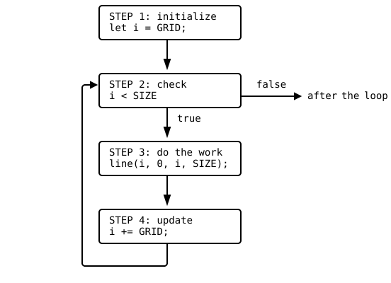

{width=400}

Look at the drawing above and count what it takes: 15 vertical lines
and 15 horizontal lines, 30 `line` statements that differ in exactly
one number. You could type them all. You typed six `circle` calls for
the dice faces, and it already felt like work. This part of the book
gives you the tool that makes such typing unnecessary: the **loop**, a
way to tell the computer "do this again, with the next number, until I
say stop". Loops are the biggest step in this course so far. A program
with loops can do thousands of things with a few lines of code, and
from now on your drawings can be as rich as you like without your
fingers paying for it.

## AI tutor {#sec-tutor-grid}

Loops are new territory, and the first loop that runs away or draws
nothing can be confusing. The tutor of this part knows the while loop
and its four steps. Show it your loop and tell it what you expected
and what you got.



One danger is worth knowing before you write your very first loop. A
loop repeats until its condition says stop, and it is surprisingly
easy to write a loop whose condition never says stop. Such a loop is
called an **endless loop** (programmers also say *infinite loop*),
and everyone who learns loops produces one sooner or later. The
playground cannot rescue you from it: the browser tab freezes, the
buttons stop reacting, and the only way out is to close the tab and
open the playground again. Everything you typed since your last save
is gone at that moment.

::: {.callout-important}
## Save before you run a loop
The playground can save your work locally in the browser or in
GitHub. Save often, and always save right before you run code with a
loop you are not completely sure about. Saving takes a second; typing
a lost program in again takes a lot longer.
:::

## Thirty statements, one idea {#sec-why-loops}

Here is the honest, loop-free way to draw the vertical lines of the
grid, with the canvas 400 pixels wide and a line every 25 pixels:

```typescript
line(25, 0, 25, 400);
line(50, 0, 50, 400);
line(75, 0, 75, 400);
// ... and twelve more of these ...
```

Every statement is the same except for one number, and that number
grows by 25 each time. Reading it out loud sounds like a robot:
"line at 25, line at 50, line at 75". And the worst part comes later:
if you want a finer grid with a line every 20 pixels, you have to
rewrite every single statement.

What you'd rather tell the computer is the *idea* behind the column:
"start at 25; as long as you haven't reached the right edge, draw a
line and move 25 to the right." That sentence is a while loop, almost
word for word.

## The while loop: four steps {#sec-while-four-steps}

Here is that sentence in TypeScript. `SIZE` is the canvas size (400)
and `GRID` is the distance between lines (25), both constants:

```typescript
let i = GRID;            // STEP 1: Initialize the loop variable
while (i < SIZE) {       // STEP 2: Check the loop condition
    line(i, 0, i, SIZE); // STEP 3: Do whatever you want to do repeatedly
    i += GRID;           // STEP 4: Update the loop variable
}
```

The variable `i` is called the **loop variable**. It is the loop's
memory: it stores how far the work has come. Here it holds the x
position of the next line to draw. The four steps around it:

1. **Initialize.** Before the loop starts, the loop variable gets its
   starting value. The first line belongs at `x = GRID`, so `i`
   starts at `GRID`.
2. **Check.** The **condition** between the parentheses works exactly
   like the condition of an `if`: a comparison that is `true` or
   `false`. As long as it is `true`, the loop keeps going. `i < SIZE`
   reads as "the next line is still on the canvas".
3. **Do the work.** The statements between the braces are the
   **loop body**. They run once per round. Our body draws one
   vertical line at `x = i`.
4. **Update.** The last statement of the body moves the loop variable
   forward: `i += GRID` shifts the position one grid step to the
   right. You know `+=` from the bouncing ball (@sec-moving-ball).

After the update, the computer jumps back to step 2 and checks the
condition again, with the new value of `i`. Check, work, update,
check, work, update, until the check says `false`. Then the computer
skips past the closing brace and the program continues.

{width=420}

One detail of the picture deserves a second look: the check comes
*before* the work, every time. When the condition is `false` at the
very first check, the body never runs at all. A while loop can run
zero times, and sometimes that is exactly right: on a canvas smaller
than one grid step, the correct number of lines is none.

::: {.callout-note}
## Why is the variable called i?
`i` is short for *index* and is the traditional name for a loop
variable; programmers have used it for generations, and everyone
reads `i` as "the loop is counting here". For a loop variable with a
clear meaning, a speaking name like `x` or `diameter` is just as
good. What stays forbidden are meaningless names like `temp`,
`helper`, `thing`, or `stuff` for everything else: the naming rules
from the Variables part (@sec-const-naming) still apply.
:::

## Play computer: the loop table {#sec-loop-table}

You can't watch the computer run a loop, but you can *be* the
computer. Take paper and pencil and walk through the loop one round
at a time, writing down the loop variable, the check, and the work.
The result is a **loop table**. To keep it short, shrink the numbers
first: here is the vertical-line loop with `SIZE = 100` and
`GRID = 25`.

| `i` | `i < 100`? | what happens |
|-----|------------|--------------------------------------|
| 25  | `true`     | line at x = 25, then `i` becomes 50  |
| 50  | `true`     | line at x = 50, then `i` becomes 75  |
| 75  | `true`     | line at x = 75, then `i` becomes 100 |
| 100 | `false`    | the loop ends                        |

: The loop table for the vertical lines with SIZE = 100 and GRID = 25. {#tbl-loop-table}

Three lines, at 25, 50, and 75. Notice the two edges of the table.
The loop starts at `GRID`, not at 0, because a line at `x = 0` would
lie on the canvas border where nobody sees it. And the line at
`x = 100` is never drawn, because `100 < 100` is `false`: the
condition `<` keeps the last line off the right border. Both edges
are design decisions, and the loop table makes them visible before
the program ever runs.

::: {.callout-important}
## Course rule: play computer with every new loop
Before you run a loop you just wrote, trace it in a loop table with
small numbers, like the table above. The table costs two minutes and
shows you the first value, the last value, and the number of rounds.
Most loop bugs, wrong start, wrong condition, forgotten update, are
visible on paper before the browser ever sees the code.
:::

## The loop that never stops {#sec-infinite-loop}

What happens when step 4 is missing?

```typescript
let i = GRID;
while (i < SIZE) {
    line(i, 0, i, SIZE);
    // the update is missing
}
```

Play computer: `i` is 25, the check says `true`, a line is drawn, and
`i` is... still 25. Check `true`, line, still 25. The condition can
never become `false`, so the loop never ends. This is the endless
loop from the start of the chapter (@sec-tutor-grid), and now you can
see exactly how one happens: the classic cause is a forgotten update.

::: {.callout-warning}
## The frozen tab
An endless loop shows no error message and no red squiggle: the code
is legal, it just never finishes. The browser tab simply freezes,
the drawing stays blank, and clicking does nothing. When that
happens, close the tab, open the playground again, and read your
loop in four-step order: is the variable initialized? Can the
condition ever become `false`? Does the update actually move the
variable toward the end? And save before you run the repaired loop,
in case the second try freezes too. Try to produce an endless loop
on purpose in the playground and see what happens. It will prepare
you for a mistake that you will make sooner or later.
:::

## Two loops, one variable {#sec-second-loop}

The grid needs a second set of lines, and the horizontal loop is the
mirror image of the vertical one. Only the `line` arguments change:
a horizontal line at height `i` runs from the left edge to the right
edge, so start and end swap their roles: `line(0, i, SIZE, i)`.

The second loop can reuse the variable of the first one. But careful:
`i` already exists, so declaring it again with `let` gives you a red
squiggle. A plain assignment resets it instead:

```typescript
i = GRID;                // back to the start: assignment, no let
while (i < SIZE) {
    line(0, i, SIZE, i);
    i += GRID;
}
```

`let i` happens once; after that, the variable belongs to the whole
function and every loop in it may use it. Resetting the loop variable
before the loop is just step 1 in different clothes.

Reusing `i` works here because the two loops run one after the
other. When a program really needs two counter variables at the same
time, programmers traditionally call the second one `j`, simply the
next letter of the alphabet. Everyone reads `i` and `j` as a pair of
counters, just like everyone reads `i` alone as "the loop is
counting here".

## Your exercise: Grid {#sec-grid-exercise}

Now build the grid yourself. The starter code contains the finished
vertical-line loop, with the four steps marked as comments. Your job
is the horizontal lines.

1. **Paper first.** Sketch the canvas on graph paper: 400 by 400,
   one line every 25 pixels. Mark where the first vertical line sits
   and count how many lines fit. You should arrive at 15.
2. **Read the starter code.** Find the four steps of the vertical
   loop and match them to the comments. Say the loop out loud:
   "start at 25, while the edge isn't reached, draw and move on."
3. **Write the horizontal loop.** Reset `i` with an assignment, keep
   the condition and the update, and swap the `line` arguments as
   shown above (@sec-second-loop). Run after every few keystrokes.
4. **Change the constants.** Set `GRID` to 50, then to 20, then put
   `SIZE` to 300. The grid must adapt by itself every time; that is
   the point of writing loops with constants instead of 30 statements
   with numbers in them.



## Your exercise, part 2: Step Lines {#sec-step-lines-exercise}

{width=400}

The second exercise starts where the grid ends: both grid loops are
already in the starter code. On top of the grid you draw colored
lines, one per row, and their lengths change from row to row. That is
the new idea of this exercise: the loop variable can do more than one
job. `i` is the height of the row, and at the same time it decides
how long the yellow part is.

Look at the picture: in every row, yellow and red meet on the
diagonal, and the diagonal is exactly where x equals y. So in the row
at height `i`, the yellow line runs from `x = GRID` to `x = i`, and
the red line continues from `x = i` to `x = SIZE - GRID`.

1. **Read the given code.** The two grid loops are your own solution.
   Below them, the starter sets `strokeWeight(2)` and
   `stroke("yellow")` once, before your loop: settings placed before
   a loop apply to every round, so all yellow lines get the same look
   without repeating the command inside the body.
2. **Paper first.** Make a loop table for the yellow loop with
   `SIZE = 100` and `GRID = 25`, with one extra column: where does
   the yellow line start, where does it end? The first row's line is
   tiny (from 25 to 25), and that is fine.
3. **Yellow first.** Write the yellow loop and run it. Only when the
   yellow staircase looks right, add the red loop after the
   `stroke("red")` line.
4. **Change the constants.** `GRID = 50`, `GRID = 20`, `SIZE = 300`:
   the staircases must follow the grid by themselves.



## Check your understanding {#sec-quiz-grid}

When your grid and your staircases work, take the short quiz below.
You answer six questions about this chapter in your own words, and an
AI reads your answers and tells you what you already understand and
what you should read again. The quiz is anonymous, and answering in
German is fine too.


