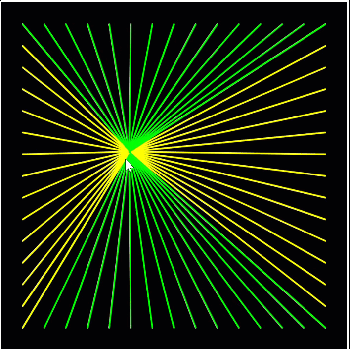
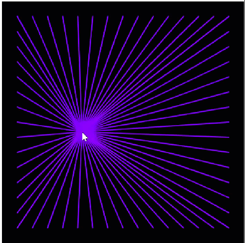

::: {.content-visible unless-format="pdf"}
{width=400}
:::

::: {.content-visible when-format="pdf"}
{width=400}
:::

The grid from the last chapter is calm: two loops run once inside
`setup`, the picture is done, nothing moves. This chapter wakes the
loops up. You put a while loop inside an event function, and suddenly
60 lines redraw themselves every time the mouse moves, like threads
pinned to the edges of the canvas. Then you go one step further and
give the rays a color that never stands still, cycling through the
color wheel like the lighting of a gaming keyboard. The loop itself
stays exactly the one you know: four steps, nothing more. What
changes is where it lives and what happens around it.

## AI tutor {#sec-tutor-rays}

Two programs meet in this chapter: a loop and an event. If your rays
don't show up, smear across the canvas, or all have the same color
when they shouldn't, tell the tutor which of the two exercises you
are in and show it your loop.



## A loop inside an event {#sec-loop-in-event}

So far, loops ran once, in `setup`. But a loop is a statement like
any other: it may live in any function. Put it into `mouseMoved`
(@sec-mouse-moved) and it runs again on every mouse move, drawing
its whole picture fresh each time:

```typescript
function mouseMoved() {
    background("black");
    strokeWeight(2);

    // the loop draws all rays for the current mouse position
}
```

The first statement repaints the background. You know that move from
the bouncing ball (@sec-draw-loop): repaint first, then draw. Without
it, every mouse position would leave its rays on the canvas, and
after a second of movement the picture would be a smeared tangle of
old lines.

## One variable, four lines {#sec-four-lines}

Where do the rays start? Look at the goal picture: the starting
points sit evenly spaced along all four edges, one grid step apart,
with a margin of 25 pixels. Those are the same positions your grid
loop visited. The new idea: in each round, the loop variable `i`
marks four points at once, one per edge:

- `(MARGIN, i)` on the left edge, and `(width - MARGIN, i)` on the
  right edge: `i` is the *height* of the point.
- `(i, MARGIN)` on the top edge, and `(i, height - MARGIN)` on the
  bottom edge: `i` is the *horizontal position* of the point.

Every ray ends at the same point: `(mouseX, mouseY)`. So one round
of the loop draws four lines, and the body sets two colors while it
works: yellow before the left-and-right pair, lime before the
top-and-bottom pair. In the grid, the color was set once before the
loop, because every line looked the same. Here two colors take turns
inside every round, so the `stroke` calls move into the body.

One more difference to the grid loop is easy to miss: the condition.
The grid stopped with `i < SIZE`, keeping the last line off the
border. The rays want anchor points *on* the last position,
`SIZE - MARGIN`, so the loop runs while `i <= SIZE - MARGIN`. Whether
`<` or `<=` is right is not a grammar question; it is a design
decision, and your loop table shows you which one you need: write
down the last value you want, and check which comparison still lets
it through.

## Your exercise: Rays {#sec-rays-exercise}

1. **Paper first.** Sketch the canvas and mark the anchor points on
   one edge: margin 25, one point every 25 pixels, the last one at
   375. Count them; you should get 15 per edge.
2. **Make a loop table** for `SIZE = 100` and `MARGIN = 25`, with the
   condition `i <= SIZE - MARGIN`. Which values does `i` take, and
   how many rounds is that?
3. **Start with one edge.** Write the loop with a single statement:
   `line(MARGIN, i, mouseX, mouseY);`. Run it and move the mouse.
   One fan of yellow rays from the left edge, nothing else.
4. **Add the other three edges**, one `line` per run, and set the
   colors: yellow before the left-and-right pair, lime before the
   top-and-bottom pair.
5. **Change the constants.** `MARGIN = 50`, then `SIZE = 300`. The
   fans must follow by themselves.



## A color that never stands still {#sec-accumulator}

::: {.content-visible unless-format="pdf"}
{width=400}
:::

::: {.content-visible when-format="pdf"}
{width=400}
:::

For the second exercise, the rays should change color continuously,
like RGB lighting. That needs two changes in how the program is
built, and both reach back to earlier chapters.

First, the loop moves from `mouseMoved` into `draw` (@sec-draw-loop).
`mouseMoved` runs only when the mouse moves, so a color animation
would freeze the moment you let go of the mouse. `draw` runs about
60 times per second, no matter what, and the starter code of the
exercise has this change already made. The rays still follow
`mouseX` and `mouseY`; those variables are always up to date, in any
function.

Second, the color needs a memory. A color that *changes* is a value
that must survive from one frame to the next, and you know the tool
for that: a global variable (@sec-global-variables), declared outside
every function.

```typescript
// The current hue value of the rays
let rayColor: number = 0;
```

The color itself is a hue on the HSB color wheel (@sec-hsb-colors),
so `setup` gets a `colorMode(HSB);` and the loop paints with
`stroke(rayColor, 100, 100);`, full saturation, full brightness. And
after every ray, the hue takes a tiny step:

```typescript
rayColor = (rayColor + 0.25) % 360;
```

Read the right side inside out: take the current hue, add a quarter
step, and then `% 360`. The modulo operator is an old friend from
digit extraction (@sec-modulo), and here it does its second job:
wrapping. As long as the sum stays below 360, `% 360` changes
nothing. The moment it reaches 360, the remainder snaps back to 0,
which is exactly right, because 360 and 0 are the same point on the
color wheel. A variable that grows step by step like this, keeping
its value between rounds and between frames, is called a
**running value**, and you will meet it in many programs, counting
points, summing prices, or turning a color wheel.

::: {.callout-note}
## Why do the rays make a rainbow?
The update line sits *inside* the loop, so the hue moves a quarter
step from one ray to the next: within a single frame, neighboring
rays differ slightly in color, which gives the fan its soft
gradient. Move the update *after* the loop and every ray in one
frame gets the same color; the fan then changes color as a whole,
one hue per frame. Both are valid designs. The exercise builds the
first one, and trying the second for a moment is a great experiment.
:::

## Your exercise, part 2: Colored Rays {#sec-colored-rays-exercise}

The starter code is a finished rays program, already living in
`draw`. The exercise text walks you through every snippet; your job
is to place them correctly and understand what each one does.

1. **Read the starter code.** Find the one difference to your own
   rays solution: the function is called `draw` now, not
   `mouseMoved`.
2. **Set the color mode.** Add `colorMode(HSB);` to `setup`.
3. **Add the global variable.** Declare `rayColor` outside every
   function, and give it its data type: the exercise shows
   `let rayColor = 0;`, and in this course every declaration carries
   its type, so write `let rayColor: number = 0;`.
4. **Recolor the loop.** Remove the two old `stroke` calls and put
   `stroke(rayColor, 100, 100);` at the top of the loop body.
5. **Add the update** `rayColor = (rayColor + 0.25) % 360;` at the
   end of the loop body, and run. The fan should slowly turn through
   the color wheel.
6. **Experiment.** Change `0.25` to `5`: faster cycling, stronger
   gradient. Then move the update after the loop for a moment and
   watch the gradient disappear. Put it back where the exercise
   wants it.



## Check your understanding {#sec-quiz-rays}

When your rays follow the mouse in ever-changing colors, take the
short quiz below. You answer six questions about this chapter in your
own words, and an AI reads your answers and tells you what you
already understand and what you should read again. The quiz is
anonymous, and answering in German is fine too.


