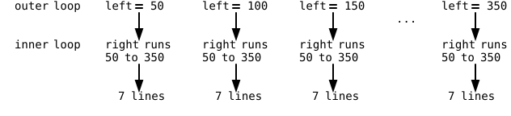

{width=400}

Look at the picture and try to count the lines. Seven points on the
left edge, seven on the right, and a line from *every* left point to
*every* right point, 49 lines in total. Typing them would be madness, and a
single loop won't do it either, because a single loop can only walk
one row of points. This chapter introduces the tool for
"every-with-every" drawings: the **nested loop**, a loop inside
another loop. Nested loops draw grids, game boards, and patterns,
and they come with one famous beginner bug that you'll meet in a
controlled experiment before it can meet you.

## AI tutor {#sec-tutor-mesh}

Two loops working inside each other are harder to read than any
single loop. If your mesh shows only one bundle of lines instead of
the full weave, or the colors don't land where you wanted them, show
the tutor your two loops and tell it which picture you expected.



## One fan first {#sec-mesh-fan}

Start small. The first stage of the mesh connects the seven left
points to a *single* point on the right edge. The left points sit at
`(MARGIN, left)` with `left` running from 50 to 350 in steps of 50,
and the target sits at `(width - MARGIN, right)`:

```typescript
let left: number = MARGIN;
while (left <= SIZE - MARGIN) {
    let right: number = MARGIN;
    line(MARGIN, left, width - MARGIN, right);

    left += MARGIN;
}
```

One thing looks odd on purpose: the target's height lives in a
variable `right`, although it never changes. `right` is 50, every
line ends at the same point, and the loop draws one fan. The
variable is preparation. In the next stage, `right` starts moving,
and the `line` statement is already written for it.

## The loop inside the loop {#sec-nested}

Now the real mesh, where every left point connects to every right
point. Think it through for a single left point, say `left = 50`.
You need lines to `right = 50, 100, ... , 350`. That is a while
loop, and you can already write it. The trick is *where* it goes.
The loop body of the outer loop may contain any statements, and a
loop is a statement. So the whole inner loop moves into the outer
body:

```typescript
let left: number = MARGIN;
while (left <= SIZE - MARGIN) {
    let right: number = MARGIN;
    while (right <= SIZE - MARGIN) {
        line(MARGIN, left, width - MARGIN, right);
        right += MARGIN;
    }

    left += MARGIN;
}
```

Play computer, but zoom out. For the outer loop, the entire inner
loop is just one statement of its body. Outer round one sets
`left = 50`, and the body runs; `right` starts at 50, the inner loop
draws all seven lines of the first fan, and ends. Then `left += 50`,
the outer check passes, and the body runs *again from the top*.
`let right = MARGIN;` makes the inner loop start fresh, and the
second fan appears. Seven fans of seven lines: 49.

{width=560}

Watch the two variables move: `right` runs fast, a full lap per fan,
while `left` moves slowly, one step per lap. You have seen this
rhythm before, in the number systems chapter, where the ones digit
turns fast and the tens digit slow (@sec-decimal-place-values).
Nested loops count exactly like digits do.

::: {.callout-warning}
## The classic nested-loop bug
Imagine the line `let right = MARGIN;` moved above the *outer* loop.
Only the first fan would appear. Why? The inner loop runs once,
leaves `right` at 400, and nothing ever resets it. In every later
outer round, the inner check `right <= 350` is false immediately,
and the inner loop runs zero times. The rule: initialize the inner
loop variable *inside* the outer loop's body, so every fan starts
fresh. Once your own mesh runs, produce this bug on purpose;
you will recognize the "only the first row shows up" picture
forever.
:::

## Where a statement sits decides how often it runs {#sec-statement-placement}

The last stage colors the mesh. All lines of one fan share a color,
and each fan's hue is 60 steps further around the HSB color wheel
(@sec-hsb-colors). You know the tool, a running value:

```typescript
let lineColor: number = 0;
```

The interesting question is where the `stroke` call goes. In a
nested loop, there are three different places, and they mean three
different things:

- **Before both loops**: runs once. One color for the whole mesh.
- **In the outer body, before the inner loop**: runs once per fan.
  All seven lines of a fan share a color; the next fan gets the next
  color. This is what the mesh needs.
- **In the inner body**: runs once per line, 49 times. Every line
  gets its own color, like the gradient of the colored rays.

The same choice you made for the rays' update line (inside the loop
or after it) returns here, one level bigger. Placement is not
cosmetics; it decides how often a statement runs and what the
picture shows.

## Your exercise: Mesh {#sec-mesh-exercise}

The exercise walks the same three stages as this chapter, and in
the playground each stage has its own goal picture. Solve them
strictly in order.

1. **Step 1: one fan.** The starter code brings the canvas, the
   constants, and a fixed `stroke("lime")`. Write a single while
   loop over `left`, with the target height in a variable `right`
   that stays at `MARGIN` for now, exactly as in the fan section
   above (@sec-mesh-fan). The anchor points sit at 50, 100, and so
   on up to 350, seven per edge.
2. **Step 2: the mesh.** Wrap the `line` statement in the inner
   loop over `right`. Keep `let right = MARGIN;` inside the outer
   body, and give the inner loop its own update. Run it; the full
   mesh with its 49 lines should appear.
3. **Step 3 (advanced): colors.** Put `colorMode(HSB);` into
   `setup` and remove the fixed `stroke("lime")`. Declare
   `let lineColor: number = 0;` before the outer loop, set
   `stroke(lineColor, 100, 100);` in the outer body before the
   inner loop, and add `lineColor += 60;` at the end of the outer
   body. One color per fan, around the color wheel.
4. **Experiment.** Move the `stroke` call and the `+= 60` into the
   inner body and run again; now every one of the 49 lines gets its
   own color. Decide which version you find more beautiful, then
   restore the exercise's version.



## Check your understanding {#sec-quiz-mesh}

When all 49 lines are in place and every fan wears its own color,
take the short quiz below. You answer six questions about this
chapter in your own words, and an AI reads your answers and tells
you what you already understand and what you should read again. The
quiz is anonymous, and answering in German is fine too.


