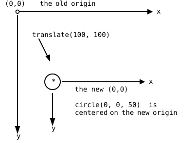

{width=400}

Way back in the practice projects of part 1, the soccer field came
with a recipe: a few lines with `push`, `translate`, and `scale`
that you copied without questions, magic words with a promise that
the details would come later. Later is now. In this chapter the
magic words become tools you understand: `translate` moves the
origin of the coordinate system, and `push` and `pop` save and
restore it. Combined with loops, they unlock a new way of drawing:
instead of computing every position, you draw in one place and move
the paper under the pen. Both exercises are discovery scripts: you
uncomment code line by line, predict, and watch.

## AI tutor {#sec-tutor-move-origin}

Transformations confuse everyone at first, because the code names
one position and the shape appears at another. When that happens to
you, tell the tutor which line you uncommented and where the circle
landed; the tutor knows the way of thinking that untangles it.



## The origin moves {#sec-translate}

Every coordinate you have ever written is measured from the
**origin**, the point (0, 0), and so far the origin has always been
the top left corner of the canvas. The `translate` command moves it:

```typescript
translate(100, 100);
circle(0, 0, 50);
```

After the `translate`, the point (0, 0) sits 100 pixels right and
100 pixels down from the corner, and every drawing command that
follows measures from there. The `circle` names the position (0, 0),
and appears at the center of what used to be (100, 100). The command
did not move the circle; it moved the ruler the circle is measured
with.

{width=340}

Three facts complete the picture, and the discovery script shows
you each one:

- **translate is relative.** A second `translate(100, 100)` moves
  the origin another 100 right and down, measured from where it
  *currently* is. Translations add up.
- **Negative values move back.** `translate(-50, 0)` moves the
  origin 50 pixels to the left, `translate(0, -50)` moves it up.
- **resetMatrix starts over.** `resetMatrix()` puts the origin back
  in the top left corner of the canvas, as if no `translate` had
  ever happened.

## Drawing without coordinates {#sec-cumulative}

Now combine `translate` with a loop. Task 2 of the exercise draws
the diagonal of circles from the goal picture, and the rule of the
game is: every circle is drawn with `circle(0, 0, CIRCLE_DIAMETER)`,
no other coordinates allowed.

```typescript
circle(0, 0, CIRCLE_DIAMETER);
for (let i = 0; i <= SIZE; i += CIRCLE_DIAMETER) {
    translate(CIRCLE_DIAMETER, CIRCLE_DIAMETER);
    circle(0, 0, CIRCLE_DIAMETER);
}
```

Each round moves the origin one step down the diagonal and draws
"here". The position is nowhere in the code; it lives in the canvas
itself, accumulated by all the translates so far, the way the hue
accumulated in the colored rays. Notice the loop variable `i`: it
appears nowhere in the body. Its only job is counting rounds, so
that the loop runs often enough to cross the canvas. A loop that
just counts rounds is perfectly normal from now on.

You could draw this diagonal with the pixel X technique instead,
computing `circle(i, i, ...)`. Same picture, two philosophies: move
the pen, or move the paper. For a single diagonal, both are fine.
For the patterns of the next chapter, moving the paper wins, and
you'll see why.

## A note before you wander: push and pop {#sec-push-pop}

Translating is a one-way street: after five translates, how do you
get back? `resetMatrix` goes all the way back to the corner, but
usually you want something gentler: "remember this spot, let me
wander, then bring me back". That is exactly what `push` and `pop`
do:

- `push()` writes a note: it saves the current origin **and** the
  current style settings (`fill`, `stroke`, `strokeWeight`, and
  friends).
- `pop()` takes the most recent note and restores everything on it.

The discovery script walks this timeline; here it is as a table:

| statement | origin afterwards |
|--------------------|-------------------|
| `translate(100, 100);` | (100, 100) |
| `push();` | (100, 100), and a note saves this spot |
| `translate(100, 0);` | (200, 100) |
| `translate(0, 100);` | (200, 200) |
| `pop();` | (100, 100) again, restored from the note |
| `translate(0, 100);` | (100, 200) |

: The push and pop timeline of the discovery script. {#tbl-push-pop}

The wandering between `push` and `pop` leaves no trace: after the
`pop`, the program continues as if the detour never happened. And
because `pop` also restores the styles, a color change inside the
detour vanishes with it.

Notes stack. If you `push` twice, you hold two notes, and each `pop`
takes back the most recent one: the first `pop` returns you to the
second `push`, the next `pop` to the first. Like sticky notes piled
on a desk, you always take the top one.

::: {.callout-important}
## Course rule: every push gets its pop
Treat `push` and `pop` as a pair, like opening and closing braces.
A `push` without its `pop` leaks: every drawing command that runs
later inherits your moved origin and changed styles, and the bug
shows up far away from its cause. Write the `pop` immediately after
the `push`, then fill the middle.
:::

## Your exercise: Move Origin {#sec-move-origin-exercise}

1. **Task 1: uncomment and predict.** The starter code is a stack
   of commented blocks. Before you uncomment each one, play
   computer: write down where you expect the next circle, then
   uncomment, run, and compare. Work through all the blocks,
   including the negative translate and the `resetMatrix` at the
   end.
2. **Task 2: paper first.** Sketch the diagonal: circles of
   diameter 50, the first centered at the corner (0, 0), each
   next one 50 right and 50 down.
3. **Write the loop.** One circle at (0, 0) before the loop, then a
   for loop whose body is exactly two statements: the translate and
   the circle, as in the section above (@sec-cumulative). No
   computed coordinates allowed.
4. **Experiment.** Change the translate to `(CIRCLE_DIAMETER, 0)`
   for a horizontal chain, then try a negative y for an upward
   staircase from the bottom (you'll need a translate before the
   loop to start at the bottom left).



## Your exercise, part 2: Push and Pop {#sec-push-pop-exercise}

The second discovery script has no drawing task and no sample
solution; its only goal is that you *see* the note-taking happen.

1. **Uncomment and predict**, block by block, like in task 1. The
   script translates to (100, 100), pushes, wanders right and down,
   pops, and continues from the saved spot. Before each run, say
   out loud where the next circle will appear.
2. **Check the styles.** Add `stroke("red")` somewhere between
   `push` and `pop`, and see that the circles after the `pop` are
   yellow again: the note restored the stroke color along with the
   origin.
3. **Stack two notes.** Add a second `push`/`pop` pair inside the
   first one, with its own small translate, and confirm: each `pop`
   returns to the most recent `push`.



## Check your understanding {#sec-quiz-move-origin}

When your diagonal runs on translate alone and the push-pop script
holds no more surprises, take the short quiz below. You answer six
questions about this chapter in your own words, and an AI reads your
answers and tells you what you already understand and what you
should read again. The quiz is anonymous, and answering in German is
fine too.


