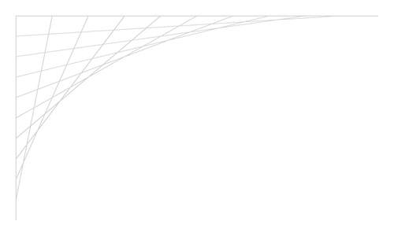
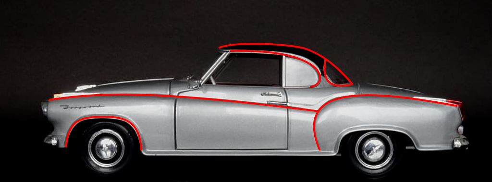
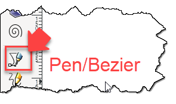
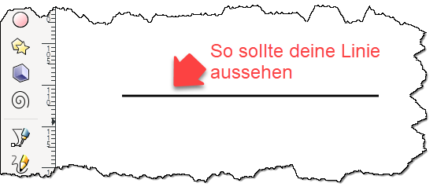
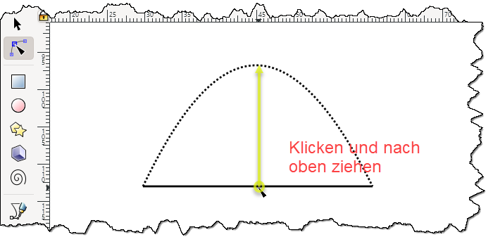
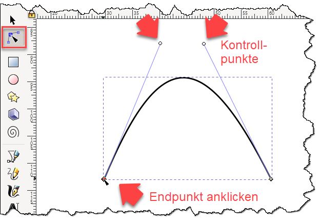

{width=400}

This closing chapter of the Loops part starts with a small
surprise. A for loop draws straight lines, only straight lines,
and a curve appears anyway. From there you give that curve its
name, bend it by hand in a professional design program, let
p5.js draw it with a single command, and finish with an AI that
turns loops and curves into a pattern of your own. Much of this
chapter follows the exercise
[Spaß mit Bezier-Kurven by CoderDojo Linz](https://linz.coderdojo.net/uebungsanleitungen/programmieren/web/bezier/).

## AI tutor {#sec-tutor-bezier}

Curves like to go somewhere you did not expect. If your fan
comes out as a box of crossing lines, or if your curve runs off
the canvas instead of bending nicely, tell the tutor what you
expected, what you actually see, and paste your loop or your
`bezier` call.



## A fan of straight lines {#sec-bezier-fan}

The first program of this chapter draws a fan, and every command
in it is one you already know. Two `line` calls draw an axis to
the right and an axis downward, `translate` moves the origin away
from the canvas corner so the drawing gets some air around it,
and a for loop with a typed loop variable draws the fan lines.
Both endpoints of every fan line are computed from the counter
`i`.

This chapter has no prepared exercise, so you type the program
into the Empty Playground yourself:

```typescript
function setup() {
    createCanvas(500, 300);
    background("white");
    stroke("lightgray");
    translate(20, 20);

    const xWidth = 460;
    const yHeight = 260;
    line(0, 0, xWidth, 0);
    line(0, 0, 0, yHeight);

    const points = 10;
    const deltaX = xWidth / points;
    const deltaY = yHeight / points;
    for (let i: number = 1; i < points; i++) {
        line(deltaX * i, 0, 0, yHeight - (deltaY * i));
    }
}
```

The loop body is the interesting line. Each round connects one
point on the horizontal axis with one point on the vertical axis.
`deltaX * i` walks to the right along the horizontal axis, and
`yHeight - (deltaY * i)` climbs upward along the vertical axis.
So the first round joins a point close to the corner with a point
far down, the last round joins a point far right with a point
close to the corner, and in between the fan opens up.

1. **Type the program in.** Open the Empty Playground below and
   write the code out. The five `const` declarations above have
   no type annotations, and that is your first job: add
   `: number` to each of them while you type, the way this course
   writes every declaration. Then format your code, check that
   there are no red squiggles, and run it.
2. **Play with `points`.** The constant `points` decides how many
   fan lines the loop draws. Try 5, then 20, then 50, then 100,
   and run after every change.
3. **Find the curve.** Every line your program draws is straight,
   and still a curve shows along the open edge of the fan, right
   where the drawn lines stop and the empty part of the canvas
   begins. The more lines you draw, the smoother that curve
   looks. No single line draws it. It appears where the lines
   crowd together, and each line just touches it at one spot.



## The curve has a name {#sec-bezier-name}

The curve at the edge of the fan is a **Bezier curve**, spoken
roughly like "bay-zee-eh". It is named after Pierre Bézier, a
French engineer who worked for the car maker Renault in the
1960s. He needed a way to describe the shape of a car body
exactly, precise enough for a machine to cut the metal, and
these curves were his answer.

{width=400}

Today Bezier curves sit everywhere a smooth shape has to be
stored exactly. Every letter of every font on this page is built
from them, every icon on your phone, every drawing made in a
vector graphics program, and many animations in games. Look at a
letter with round shapes, an S or an R, and follow its outline
with your eyes. Somebody once placed the points of those curves.

Your fan's curve is described by three points, and you can point
at all three in your own program:

- It starts at the lower end of the vertical axis.
- It ends at the right end of the horizontal axis.
- It bends toward the corner where the two axes meet, and it
  never reaches that corner.

The corner is the **control point** of the curve. A control point
pulls the curve toward itself, like a magnet, but the curve does
not run through it. The straight lines of your fan are the
construction lines of exactly this curve, which is why the curve
showed up without anybody drawing it.

A curve with a start point, an end point, and one control point
is called a **quadratic** Bezier curve. Give it two control
points instead, one pulling near the start and one pulling near
the end, and it is a **cubic** Bezier curve. Cubic curves can do
more, an S shape for example, and most programs use them. The
p5.js command further down in this chapter draws cubic curves,
and so does the design program in the next section.

{width=400}

::: {.callout-tip}
## Want to go deeper?
This part is voluntary, and it is the best kind of voluntary.
The video [The Beauty of Bézier Curves](https://youtu.be/aVwxzDHniEw)
shows where the curves come from and how fonts use them. On the
[interactive GeoGebra page about Bezier curves](https://www.geogebra.org/m/ek7RHvuc)
you can drag the control points yourself and watch the
construction lines follow.
:::

## Bending curves in Inkscape {#sec-bezier-inkscape}

Inkscape is a free vector graphics program that designers and
software developers use for real work, and every shape you draw
in it is made of Bezier curves. Get it from the
[Inkscape download page](https://inkscape.org/) and install it
yourself. Installing a program is a skill of its own, so this
book gives you no click-by-click instructions for it. If you get
stuck, that is what the AI tutor and a search engine are for.

Once Inkscape runs, play with it in four steps.

1. **Pick the pen tool.** It is also called the Bezier tool, and
   its icon shows a pen drawing a line.

   {width=300}

2. **Draw a straight line.** Click once for the start point,
   click a second time somewhere else for the end point, and
   press `Enter` (a double click on the last point works too).
   You get a plain straight line.

   {width=400}

3. **Bend the line.** Switch to the node tool, the arrow at the
   top of the tool bar that edits points. Grab the line in the
   middle and drag it upward. The straight line bends into a
   curve while you drag.

   {width=400}

4. **Show the handles.** Click one of the two end points of your
   curve. Two thin lines pop out with a small circle at the end
   of each. Drag one of these circles and watch the curve change
   shape.

   {width=400}

Those small circles at the ends of the handles are the control
points, the very same idea as the corner in your fan. They pull
the curve toward themselves, and the curve stays away from them.
Two handles, two control points, so an Inkscape segment is a
cubic Bezier curve.

Now take about 10 minutes of free play. Draw a heart, a wave, a
fish, a mountain range, whatever needs smooth curves. YouTube is
full of short tutorials about the Inkscape pen tool, and looking
one up is a good move, not cheating.

## The bezier command {#sec-bezier-p5}

p5.js draws Bezier curves for you with one command and eight
numbers:

```
bezier(x1, y1, cx1, cy1, cx2, cy2, x2, y2)
```

The eight numbers are four points in a fixed order, namely the
start point, the first control point, the second control point,
and the end point. Two control points means this is a cubic
Bezier curve, the same kind a design program draws.

Two details are worth knowing before you type the next program.
First, p5.js treats a curve like a shape: with a fill color set,
it paints the area the curve encloses. `noFill()` switches that
off, and one of the experiments below switches it back on so you
can see the difference. Second, the drawing happens inside
`draw`, so the picture is repainted every frame and the curve
follows your mouse.

```typescript
function setup() {
    createCanvas(510, 500);
}

function draw() {
    background("white");
    noFill();

    const upperY: number = 205 - abs(mouseY - 205);
    const lowerY: number = 205 + abs(mouseY - 205);

    stroke("red");
    strokeWeight(5);
    bezier(5, 205, mouseX, upperY, mouseX, lowerY, 505, 205);

    stroke("blue");
    circle(5, 205, 4);
    circle(505, 205, 4);
    circle(mouseX, upperY, 4);
    circle(mouseX, lowerY, 4);

    strokeWeight(1);
    line(5, 205, mouseX, upperY);
    line(505, 205, mouseX, lowerY);
}
```

Read the program point by point.

- The start point (5, 205) and the end point (505, 205) never
  move. Both sit on the same horizontal line, a little above the
  middle of the canvas, one near the left edge and one near the
  right edge.
- `abs(mouseY - 205)` is the distance of the mouse from that
  line. `abs` throws the minus sign away, so the distance is
  never negative. `upperY` lies exactly that far above the line,
  `lowerY` the same amount below it.
- Both control points sit at `mouseX`, one at `upperY` and one at
  `lowerY`. The two mirror each other around the line, one
  pulling up and one pulling down, and that mirroring is what
  bends the curve into an S.
- The blue circles mark all four points, and the two thin blue
  lines connect each end of the curve with the control point that
  belongs to it. They are the same handles you dragged in the
  design program.

{width=400}

1. **Type it in and move the mouse.** Use the Empty Playground
   below, either the one with your fan or a fresh one. Format,
   run, and then move the mouse slowly across the canvas. Watch
   how the curve chases the two control points without ever
   touching them.
2. **Aim at the middle line.** Move the mouse until it sits on
   the height of the two fixed points, at y = 205. The distance
   becomes 0, both control points land on the line, and the curve
   turns into a straight line.
3. **Experiment.** Swap `upperY` and `lowerY` inside the `bezier`
   call and you get an arch instead of an S. Then replace both
   control points with (`mouseX`, `mouseY`), so the two become
   one, and see the simple bow that a single control point
   produces. Replace `noFill()` with `fill("gold")` and run: the
   area the curve encloses gets painted, and the four little
   circles get a gold filling too. Put `noFill()` back, then
   change colors and stroke weights until it looks the way you
   want.



## Your exercise: curve patterns with an AI {#sec-bezier-ai-pattern}

Here is the finale of the Loops part. You take the row recipe
from the patterns chapter (@sec-row-recipe), where an outer loop
notes its position with `push`, an inner loop draws across, and
`pop` brings the origin home again, and you combine it with
`bezier` into a pattern of your own design. You will not type
that program. You describe what you want and an AI writes the
code, just like the animal exercise back in the first part
(@sec-animal). Judging the answer and understanding it is the
real work.



1. **Design first.** Decide what should repeat before you write a
   word to the AI. Waves like water, roof tiles, flower petals,
   woven ribbons, a snake of S curves? Settle on a rough number
   of rows and columns and on your colors.
2. **Write the prompt.** Describe your pattern precisely, because
   the AI grants what you say, not what you mean. Say that you
   are a beginner and that the code you paste shows everything
   you have learned. Ask it to keep the structure of your
   playground, so p5.js and TypeScript, `setup` and `draw`, and
   explicit type annotations on every declaration. Then paste
   your working curve program from the section above underneath
   your description.
3. **Run and iterate.** Put the answer into the playground and
   run it. If the pattern is not what you pictured, either adjust
   numbers yourself or send a follow-up prompt saying what should
   change. Repeat until the result is worth keeping.
4. **Keep only what you understand.** The old rule still decides.
   Every line you cannot explain gets asked about or thrown out.
   Format the finished program, and expect to show your pattern
   in class and explain a line or two of it.

## Check your understanding {#sec-quiz-bezier}

When your fan and your S curve both run, and you can say in your
own words what a control point does, take the short quiz below.
You answer six questions about this chapter in your own words,
and an AI reads your answers and tells you what you already
understand and what you should read again. The quiz is anonymous,
and answering in German is fine too.


