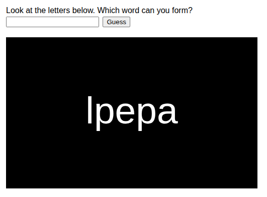
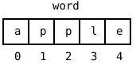
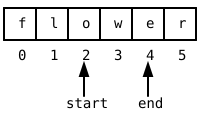

{width=440}

So far, every variable in your programs has held exactly one thing,
one number, one color, one string. This part of the book changes
that. You will learn about **arrays**, variables that hold a whole
list of things: eleven player names, a hundred bubbles, all the fill
levels of a factory. Before the first array appears, you start with
something you have used since part 2 without ever looking inside.
The string is itself a list, a row of characters, and in this
chapter you take one apart and put it back together in a new order.
The result is a little game. Word Swirrel scrambles a secret word,
and the player has to guess what it was.

## AI tutor {#sec-tutor-word-swirrel}

Picking a string apart character by character is new territory, and
everyone stumbles over the counting once. If a letter comes out that
you did not expect, or the word "undefined" shows up on your canvas,
tell the tutor what you wrote and what appeared.



## Look inside a string {#sec-string-index}

Take the string `"apple"`. You know it as one value, but the
computer stores it as a row of five characters, and every character
has a number, called its **index**:

{width=220}

Two new tools let you work with that row. First, `word.length` tells
you how many characters the string has. Second, square brackets pick
out a single character by its index:

```typescript
const word: string = "apple";
// word.length is 5
// word[0] is "a"
// word[1] is "p"
// word[4] is "e"
```

The index of the first character is 0, not 1. So the last character
does not sit at index `word.length` but at `word.length - 1`: five
characters, indexes 0 to 4. Read `word[i]` out loud as "the
character at position i".

::: {.callout-note}
## Why does counting start at 0?
The index answers the question "how many characters do I have to
jump over to reach the one I want?" To reach the first character you
jump over none, so its index is 0; to reach the fifth you jump over
four, so its index is 4. Programmers count like this everywhere, and
from now on you will too.
:::

::: {.callout-warning}
## One step too far
`word[5]` for `"apple"` is not an error message, it is worse: the
program keeps running and gives you the value `undefined`, which
then shows up as the text "undefined" on your canvas or breaks a
comparison much later. When a strange `undefined` appears, check
your indexes first; the largest valid one is `word.length - 1`.
:::

## Growing a string piece by piece {#sec-string-grow}

You have built strings before, with template strings like
`` `Clicks: ${clickCount}` ``. This chapter adds the second way. You
glue strings together with `+`, and you grow a variable with `+=`,
exactly like adding numbers to a running total:

```typescript
let scrambledWord: string = "";
scrambledWord += "p";   // scrambledWord is now "p"
scrambledWord += "a";   // scrambledWord is now "pa"
```

The starting point is `""`, the empty string you know as the
"nothing yet" value. Each `+=` hangs one more piece on the right
end. A variable that collects results round by round is called an
**accumulator**, and you have met one before: the running hue of the
colored rays worked the same way, only with numbers.

::: {.callout-important}
## Course rule update: + is now allowed for strings
In the Variables part, the course rule said that strings grow only
through template strings, never with `+`. That rule protected you
while types were new, because `+` between a number and a string can
produce surprises like `"1" + 1` being `"11"`. You know types well
enough now: from this part on, `+` and `+=` on strings are allowed
and normal. Template strings stay the best choice when you mix text
and variables in one sentence.
:::

## Cutting pieces out: substring {#sec-substring-cut}

The opposite of gluing is cutting. Every string has the method
`substring(start, end)`. It copies the part that begins at index
`start` and ends just *before* index `end`. The character at `end`
is not included:

```typescript
const flower: string = "flower";
// flower.substring(2, 4) is "ow"
// flower.substring(2) is "ower"
```

{width=260}

If you leave out the second number, `substring(start)` copies
everything from `start` to the end of the string. And here is the
trick this chapter is built on. Combining two cuts removes a single
character. Everything before index `i`, glued to everything after
index `i`, is the string without the character at `i`:

```typescript
// word is "aple", i is 2
word = word.substring(0, i) + word.substring(i + 1);
// word.substring(0, 2) is "ap", word.substring(3) is "e"
// word is now "ape"
```

One thing `substring` never does is change the string it is called
on. It hands you a copy of the piece, and the original stays as it
is. To keep the shorter word, you assign the result back to the
variable, as in the line above.

## The scramble recipe {#sec-scramble-recipe}

Now the pieces click together into the heart of Word Swirrel. The
secret word waits at the top of the program, in a constant the
player never sees on screen, `const wordToGuess = "apple";`. The
idea of the scramble is drawing letters out of a bag: pick a random
letter of the word, append it to the scrambled result, remove it
from the bag, and repeat until the bag is empty.

```typescript
let wordToScramble: string = wordToGuess;
let scrambledWord: string = "";

while (wordToScramble.length > 0) {
    let letterIndex: number = floor(random(wordToScramble.length));
    scrambledWord += wordToScramble[letterIndex];
    wordToScramble = wordToScramble.substring(0, letterIndex)
        + wordToScramble.substring(letterIndex + 1);
}
```

Check the loop against the four steps from the Loops part. The loop
variable is unusual: it is the string `wordToScramble` itself.

1. **Initialize.** The bag starts as a copy of the secret word.
2. **Check.** The loop keeps going as long as characters are left.
3. **Do the work.** One random character moves over to
   `scrambledWord`.
4. **Update.** The substring line makes the bag one character
   shorter, so `length` sinks by one each round and the loop is
   guaranteed to end.

Here is one possible run with the word `"tea"`. `random` decides the
indexes, so your run will differ:

| round | `wordToScramble` | `letterIndex` | `scrambledWord` afterwards |
|-------|------------------|---------------|----------------------------|
| 1     | `"tea"`          | 1             | `"e"`                      |
| 2     | `"ta"`           | 1             | `"ea"`                     |
| 3     | `"t"`            | 0             | `"eat"`                    |

: One possible scramble of the word "tea". {#tbl-scramble-run}

One small novelty hides in the `random` call: with a single
argument, `random(n)` is short for `random(0, n)`. The bag holds
`wordToScramble.length` characters, so
`floor(random(wordToScramble.length))` is a random valid index,
the dice recipe from the Conditions part with the upper bound
taken from the data instead of written as a number.

## A function you fill in: guess {#sec-guess-function}

Word Swirrel needs one more piece. The player types a guess and
clicks a button. The playground page for this exercise has a text
box and a Guess button above the canvas, and the starter code
contains this:

```typescript
// This method will be called automatically when the user clicks "Guess".
// The guessed text will be in "textInput".
function guess(textInput: string) {
    // <<< Add your code here
}
```

This works like `mouseClicked`. You do not call `guess` yourself;
the playground calls it for you when the button is clicked. The
part between the parentheses is new. `textInput` is a
**parameter**, a variable that the playground fills with the typed
text before your code runs. Inside the braces you use `textInput`
like any string variable. Treat this as a cliffhanger, left open on
purpose. What a function really is, what the line with the
parentheses means, and how you write functions of your own is a big
enough story that a later part of this book covers it in full.
Until then, signatures like this one are always given, and your job
is only the body:

```typescript
if (textInput === wordToGuess) {
    background("green");
    text("Correct!", WIDTH / 2, HEIGHT / 2);
} else {
    background("red");
    text(`Wrong!\nIt was "${wordToGuess}"`, WIDTH / 2, HEIGHT / 2);
}
```

You know comparing strings with `===` from rock, paper, scissors,
including the catch that capitalization matters. The only new
character is `\n` inside the template string: it is not shown as
text but stands for a **line break**, so "Wrong!" and the solution
appear on two lines.

## Your exercise: Word Swirrel {#sec-word-swirrel-exercise}

This exercise is a type-in: the code is given, and your job is to
type it, run it, and understand every line.

1. **Type in the program.** Use the listings above. The scramble
   loop goes into `setup`; after it, draw `scrambledWord` centered
   on the canvas with `text`, and the comparison goes into `guess`.
   Type, don't paste, because your fingers learn the index and
   substring syntax now, before the array chapters need it.
2. **Play computer.** Take the word `"ape"` and scramble it on
   paper like in the table above (@tbl-scramble-run), choosing the
   random indexes yourself. Write down `wordToScramble`,
   `letterIndex`, and `scrambledWord` for every round.
3. **Experiment.** Change the secret word to your own word. Then
   print `scrambledWord.length` somewhere on the canvas. Then try
   `text(wordToGuess[10], ...)` with a short word and watch the
   `undefined` appear, so you recognize it when it happens by
   accident.
4. **Read the sample solution.** It is the same program with long
   comments that explain it, including a picture of how the two
   substring calls split the word. Read it line by line.



## Check your understanding {#sec-quiz-word-swirrel}

When your Word Swirrel runs and the paper scramble of `"ape"` holds
no more questions, take the short quiz below. You answer six
questions about this chapter in your own words, and an AI reads your
answers and tells you what you already understand and what you
should read again. The quiz is anonymous, and answering in German is
fine too.


