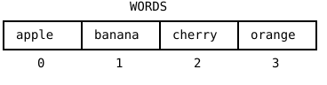

{width=420}

Word Swirrel can still only play one word: whoever read the code
knows the answer forever. Level 3 fixes that with the idea this
whole part is named after. An **array** is a variable that holds a
whole list of values: twenty words, and the program picks one at
random on every start. The change to your code is tiny, three lines,
but the idea is one of the biggest in programming. From now on,
"many things" no longer means "many variables".

## AI tutor {#sec-tutor-first-array}

Arrays bring new syntax: brackets, commas, a strange type
annotation. If the red squiggles pile up when you type your first
array, show the tutor your lines; a lost comma or bracket is found
in seconds.



## From one string to many {#sec-array-literal}

Here is an array that holds four strings:

```typescript
const WORDS: string[] = [
    "apple",
    "banana",
    "cherry",
    "orange"
];
```

Read it in three parts. The type annotation `string[]` says: this
variable holds an *array of strings*, a row of values where each
one is a string. The square brackets on the right are the **array
literal**: the elements, separated by commas, between `[` and `]`.
Writing each element on its own line is not required, but for long
lists it keeps the code readable, and you may leave a comma after
the last element too. The name is in ALL_CAPS because the word list
is configuration, like `SIZE` and `GRID` were: the naming rules
don't change.

The picture at the top of the chapter shows how to think about it:
a row of boxes, each box numbered, counting from 0. That should
feel familiar, because a string is exactly the same picture with
characters in the boxes. The last chapter's sentence "a string is a
row of characters" now gets its general form: an array is a row of
anything. There are arrays of numbers too, written `number[]`; they
carry the soccer players' shirt numbers in a later chapter.

## Picking one at random {#sec-random-element}

You know `random` as a number machine: `random(6)` returns a random
decimal number. Hand it an array instead, and it does something much
friendlier:

```typescript
wordToGuess = random(WORDS);
```

`random(WORDS)` returns one random **element** of the array, not a
number. With the four-word array above, the result is `"apple"`,
`"banana"`, `"cherry"`, or `"orange"`, each equally likely. No
index arithmetic, no `floor`: p5.js picks the element for you. One
call per program start, and every run plays a different word.

## A variable declared empty {#sec-declare-later}

The third change is the sneakiest. In level 2, the secret word was
`const wordToGuess = "apple"`. Now the word is only known once
`setup` has rolled the dice, so the declaration and the assignment
split up:

```typescript
let wordToGuess: string;   // declared, no value yet

function setup() {
    // ...
    wordToGuess = random(WORDS);
    // ...
}
```

You have seen this shape once before, with `let message: string;`
in the Conditions part: declare with a type, assign before you
read. A `const` cannot do this split, because a `const` must get
its value at the declaration; that is why the level 3 starter
changed the keyword to `let`.

::: {.callout-warning}
## The trap: declaring it inside setup
It is tempting to write `const wordToGuess = random(WORDS);` inside
`setup`, and the scramble loop even works. But then the variable
belongs to `setup` alone, and the `guess` function, which compares
the player's input against `wordToGuess`, gets the red squiggle
"Cannot find name 'wordToGuess'". The word must live in a global
variable, declared outside every function, so that `setup` can
write it and `guess` can read it. That is exactly the global-
variable rule from the Variables part: global only when two
functions need the same value, and here they do.
:::

## Your exercise: Word Swirrel (Level 3) {#sec-first-array-exercise}

The starter code is the finished level 2. Three changes make it
level 3:

1. **Type the array.** Above the constants, declare
   `const WORDS: string[]` with about 20 words from the exercise
   page, one per line. Type it; your fingers learn where the
   commas, quotes, and brackets go.
2. **Split the declaration.** Change `let wordToGuess = "apple";`
   to the empty declaration `let wordToGuess: string;` and assign
   `wordToGuess = random(WORDS);` at the top of `setup`, before the
   letter loop.
3. **Run it a few times.** A different word should scatter on every
   start. Guess a few yourself; with 20 words, even you won't
   always know the answer.
4. **Experiment.** Add your own words, short and long: the letter
   loop follows `wordToGuess.length`, so nothing else needs to
   change. Then shrink `WORDS` to a single word and run twice: with
   one element, `random` has no choice.



## Check your understanding {#sec-quiz-first-array}

When your game plays a fresh word on every run, take the short quiz
below. You answer six questions about this chapter in your own
words, and an AI reads your answers and tells you what you already
understand and what you should read again. The quiz is anonymous,
and answering in German is fine too.


