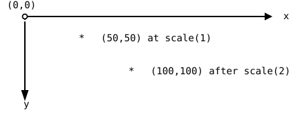

{width=400}

This short chapter takes a break from strings and arrays, on
purpose, because the exercises after it need one more drawing tool.
Back in the practice projects of part 1, the soccer field recipe
contained three magic words: `push`, `translate`, and `scale`. The
Loops part explained the first two. `scale` is the last one, and
after this chapter the recipe holds no secrets. `scale` makes
everything you draw bigger or smaller by a factor, and, as the goal
picture shows, it does something to positions that surprises almost
everyone.

## AI tutor {#sec-tutor-scale}

"I scaled my circle and it jumped somewhere else" is one of the most
common confusions in this course, and this chapter exists to clear
it up. If the pictures still surprise you after reading, ask the
tutor to walk through one example with you, step by step.



## Scale multiplies everything {#sec-scale-multiplies}

`scale(2)` tells the canvas: from now on, multiply everything by 2.
Like `translate` and `rotate`, it changes the coordinate system for
everything drawn after it, and `pop` undoes it. But "everything"
really means everything:

```typescript
scale(2);
circle(50, 50, 50);
```

The circle's diameter becomes 100, and its center lands at
(100, 100), because the *coordinates* are multiplied too. The call
still says (50, 50); the scaled coordinate system puts that point
twice as far from the origin.

{width=420}

Even the stroke is multiplied: a `strokeWeight(3)` line drawn under
`scale(2)` comes out 6 pixels wide. The cure is compensation. Set
`strokeWeight(3 / 2)` instead, and the scaling doubles the one and
a half pixels back to the 3 the eye expects; the exercise code
below plays this trick for every scaled circle. Factors below 1
work as well; `scale(0.5)` shrinks everything to half size, and
decimals like `scale(2.5)` are fine.

## Your exercise: Scaled Circles {#sec-scaled-circles-exercise}

The first exercise is a type-in. Here is the code; the three blocks
draw the three circles of the goal picture:

```typescript
stroke("blue");
strokeWeight(3);
circle(50, 50, 50);

push();
stroke("red");
scale(2);
strokeWeight(3 / 2);
circle(50, 50, 50);
pop();

push();
stroke("green");
scale(4);
strokeWeight(3 / 4);
circle(50, 50, 50);
pop();
```

1. **Predict first.** Before you run it, write down where the red
   and green circles will land and how big they will be. Center and
   diameter, both times.
2. **Type it in and run.** Compare with your prediction and with
   the goal picture. The first block needs no `push`/`pop` because
   it never touches the coordinate system; the other two clean up
   after themselves, as every transformation should
   (@sec-push-pop).
3. **Experiment.** Change the factors, try `scale(0.5)`, and remove
   one `strokeWeight` compensation to see the fat outline. One
   thing you cannot fix by experimenting yet: making the circles
   share a center. That is the second exercise.



## The point that cannot move {#sec-scale-fixed-point}

Why did the circles drift? Because their center (50, 50) is a
distance away from the origin, and scaling multiplies that
distance. Which point does *not* drift? The origin itself:
multiplying 0 by any factor gives 0. The origin is the fixed point
of scaling, the one spot that stays exactly where it is.

That observation turns into a recipe you already know from
`rotate` (@sec-rotate): put the origin where the action should
happen, then draw at (0, 0).

```typescript
translate(150, 150);  // the shared center

circle(0, 0, 50);     // blue, scale 1

push();
scale(2);
circle(0, 0, 50);     // red: bigger, but NOT moved
pop();
```

A circle whose center is (0, 0) sits on the fixed point: `scale`
multiplies its diameter, but its center, 0 away from the origin in
both directions, stays put. Translate once, draw everything at the
origin, and scaling changes only the size. That is precisely how
the part 1 soccer field recipe worked; `translate` placed the
field, and `scale` blew up meters into pixels around it.

## Your exercise, part 2: Scaled Circles (Centered) {#sec-scaled-centered-exercise}

The starter code is the finished first exercise. The goal picture
shows the fix: three concentric rings, blue inside red inside
green.

{width=400}

1. **Pick the center.** The biggest circle has diameter 50 times 4,
   which is 200 pixels, so the shared center must stay at least 100
   pixels away from every edge of the 400 by 400 canvas. The goal
   picture uses (150, 150), but any spot with that safety margin
   works.
2. **One translate for all.** Move the origin to your center once,
   at the top, before the blue circle. This translate stays outside
   every `push`/`pop` pair on purpose: all three circles should
   share it.
3. **Draw at the origin.** Change all three `circle` calls to
   `circle(0, 0, 50)` and run. The scale factors stay as they are;
   only the coordinates change. If your rings are still not
   concentric, one of your circles is not being drawn at (0, 0).



## Check your understanding {#sec-quiz-scale}

When your rings sit inside each other and you can say *why* the
blue circle never moves, take the short quiz below. You answer six
questions about this chapter in your own words, and an AI reads
your answers and tells you what you already understand and what you
should read again. The quiz is anonymous, and answering in German
is fine too.


