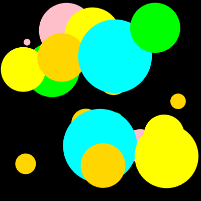
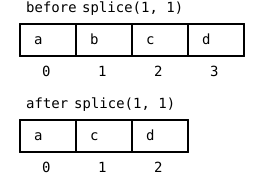

{width=400}

The soccer arrays were fixed, eleven players at the start, eleven at
the end. This chapter cuts arrays loose. The bubbles program starts
with *empty* arrays and grows them while it runs; every second or
two, `push` appends a new bubble. Then the follow-up exercise
teaches the opposite move, `splice`, which removes a bubble whose
time is up. Along the way you meet `millis`, the program's clock, and the
biggest idea of the chapter, the one that carries every animated
program from now on: the arrays are the program's memory, and the
canvas is just a picture of them, repainted sixty times a second.

## AI tutor {#sec-tutor-bubbles}

Growing and shrinking arrays are the first data that changes while
you watch. If your bubbles change color mid-flight or vanish in the
wrong order, something knocked your arrays out of step; describe to
the tutor what you see and paste the lines that change your arrays.



## The empty array {#sec-empty-array}

An array does not need its elements at the declaration. This is an
array of numbers that holds nothing yet:

```typescript
const circlesDiameter: number[] = [];
```

The type annotation `number[]` now really earns its place. With no
elements between the brackets, the annotation is the only clue
about what the array will hold. From an empty start, `push`
appends elements at the end:

```typescript
circlesDiameter.push(80);   // length is now 1
circlesDiameter.push(35);   // length is now 2, at indexes 0 and 1
```

`push` on an array and `pop` for the drawing settings share a name
family by accident; they have nothing to do with each other. The
array `push` simply means: hang this value on the end. Each push
raises `length` by one, and the new element gets the next free
index.

::: {.callout-note}
## A const that changes?
`const circlesDiameter` and then `push` into it, without a red
squiggle? Yes. `const` forbids *reassigning the variable*, like
`circlesDiameter = [1, 2, 3];`. What is stored *inside* the array
may change freely. The box is nailed down; the content is not.
This is normal TypeScript style: an array variable is `const`
unless you plan to replace the whole array.
:::

## Four arrays, one bubble {#sec-bubble-arrays}

A bubble has a position, a size, and a color, so the program keeps
four parallel arrays, `circlesCenterX`, `circlesCenterY`,
`circlesDiameter`, and `circlesFill`. Creating one bubble means one
push into *each* of them; the size comes first, drawn up to a
constant `maxDiameter`:

```typescript
const d: number = random(10, maxDiameter);
circlesDiameter.push(d);
circlesCenterX.push(random(d / 2, width - d / 2));
circlesCenterY.push(random(d / 2, height - d / 2));
circlesFill.push(random(availableColors));
```

The position uses the diameter: the center stays at least half a
bubble away from every edge, so no bubble is ever cut off. The
color comes from `random(availableColors)`, the pick-an-element
`random` from Word Swirrel level 3, applied to a little palette
array of color names.

::: {.callout-warning}
## Keep the arrays in step
Parallel arrays that grow have a new way to break: forget one of
the four pushes, and from that bubble on, every color belongs to
the wrong circle, and the last bubble reads `undefined`. Whenever
you push, push into all parallel arrays, in one place, together.
:::

## The program's clock: millis {#sec-millis}

New bubbles should appear every half second to two seconds, not
sixty times a second. For that, the program needs a clock.
`millis()` returns the number of milliseconds since the program
started. The scheduling trick is to store a *deadline*:

```typescript
if (millis() >= nextCircle) {
    // ... push the four values ...
    nextCircle = millis() + random(500, 2000);
}
```

`nextCircle` holds the time at which the next bubble is due. Every
frame, `draw` checks the clock against the deadline. As long as the
bubble is not due, nothing happens. Once it is due, the code
creates the bubble and sets a new deadline half a second to two
seconds into the future. The wall clock keeps
running; the program just compares against it. The deadline pattern
is a good fit whenever the pause changes from round to round and the
work belongs to the drawing anyway, and both are true here. A later
chapter adds a second way to say "every so often", for jobs that
need a fixed rhythm instead.

## The arrays are the truth {#sec-arrays-are-truth}

Here is `draw`, with the push details folded into a comment,
because its shape matters more than any line:

```typescript
function draw() {
    background("black");

    if (millis() >= nextCircle) {
        // push a new bubble, set the next deadline
    }

    noStroke();
    for (let i: number = 0; i < circlesDiameter.length; i++) {
        fill(circlesFill[i]);
        circle(circlesCenterX[i], circlesCenterY[i], circlesDiameter[i]);
    }
}
```

`background("black")` wipes the canvas *every frame*, sixty times a
second, and yet no bubble is ever lost. Why not? Because the
bubbles don't live on the canvas; they live in the arrays. The loop
redraws every stored bubble from scratch each frame, so the picture
looks constant even though it is repainted constantly.

Compare that with the colored rays back in the Loops part, where
the canvas itself was the memory; the program never repainted the
background and the rays piled up. Both styles work, but the array
style is stronger: the program can *change* its memory, and the
picture follows. That is exactly what the second half of this
chapter does, when bubbles start to burst.

## Your exercise: Bubbles {#sec-bubbles-exercise}

The exercise is a type-in of the bubbles program; the complete code
is in the exercise description as a picture, so your fingers type
every bracket themselves.

1. **Type it in, in three sittings.** First the five global
   declarations and the palette array, then the deadline `if` in
   `draw`, then the drawing loop. Run after each sitting; after
   the second one you'll see nothing yet, and that is fine,
   because nothing reads the arrays so far.
2. **Watch it grow.** Run the finished program for a minute. New
   bubbles keep coming, old ones never leave. The arrays only ever
   grow, and after a while the canvas is packed. Remember that
   sight; the second exercise fixes it.
3. **Experiment.** Add your favorite colors to the palette, make
   the deadlines shorter, and try `random(10, 40)` for tiny
   bubbles only. Each change touches exactly one line, because
   everything else follows the data.



## Removing elements: splice {#sec-splice}

Bubbles should burst. The removing tool is `splice`.
`myArray.splice(i, 1)` removes one element at index `i`. The
elements after it slide one index to the left, and `length` shrinks
by one:

{width=280}

For bursting, every bubble gets a lifetime. A *fifth* parallel
array holds it, filled at creation with its personal deadline, the
same pattern as `nextCircle`:

```typescript
circlesLifetime.push(millis() + random(2000, 4000));
```

Every frame, a loop checks which bubbles are overdue and splices
them out of **all five** arrays, so the columns stay aligned:

```typescript
for (let i: number = circlesLifetime.length - 1; i >= 0; i--) {
    if (millis() >= circlesLifetime[i]) {
        circlesCenterX.splice(i, 1);
        circlesCenterY.splice(i, 1);
        circlesDiameter.splice(i, 1);
        circlesFill.splice(i, 1);
        circlesLifetime.splice(i, 1);
    }
}
```

Look at the loop header: it runs **backwards**, from the last index
down to 0. That is not a matter of taste. When `splice` removes
index 2, the old index 3 *becomes* index 2. A forward loop would
step on to index 3 next and never look at the element that just
slid into position 2. It skips a bubble, every time it removes one.
Walking backwards, the sliding happens only in the part of the
array the loop has already visited, and nothing is skipped.

::: {.callout-warning}
## Removing while looping: always go backwards
Any loop that may `splice` elements out of the array it is walking
must walk from `length - 1` down to 0. Forwards it silently skips
the element after each removal; you will not get an error, just
bubbles that burst one frame too late, or never. This rule applies
to every remove-while-looping situation, not just bubbles.
:::

## Your exercise, part 2: Bubbles (Splice) {#sec-bubbles-splice-exercise}

The starter code is the finished Bubbles program. You add the
bursting.

1. **The fifth array.** Declare `circlesLifetime: number[]`, and
   push a deadline of two to four seconds into it wherever a bubble
   is created, next to the other four pushes.
2. **Paper first.** Take the array picture above (@sec-splice) and
   walk a forward loop over `[a, b, c, d]` that removes every
   element: which elements does it actually visit? Then walk it
   backwards. Now you know why the header looks the way it does.
3. **The removal loop.** Write the backwards loop with the five
   splice calls and run it; bubbles now appear, live for a few
   seconds, and pop. The canvas stays alive instead of filling up.
4. **Experiment.** Give bubbles ten seconds to live, then half a
   second. Then break it on purpose: turn the loop forwards, run
   it, and watch bubbles overstay. Turn it back.



## Check your understanding {#sec-quiz-bubbles}

When your bubbles come and go and you can explain the backwards
loop to a classmate, take the short quiz below. You answer six
questions about this chapter in your own words, and an AI reads
your answers and tells you what you already understand and what you
should read again. The quiz is anonymous, and answering in German
is fine too.


