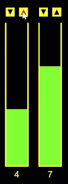

{width=440}

The last chapter of this part is a real little application. A
factory wants a dashboard for its silos: show every fill level,
warn in red when one runs critical, and let the operator add or
remove material with buttons. Every idea of the part reports for
duty: the fill levels arrive as a string and are parsed into an
array, the array decides how many silos exist, the mouse *changes*
the array, and the canvas repaints whatever the array says, frame
after frame. When this program runs, you have built your first
interactive data application.

## AI tutor {#sec-tutor-silos}

This is the largest program of the course so far, and large
programs fail in small places: one wrong constant in a hit test,
one forgotten flush in the parser. Build it task by task, and when
something misbehaves, tell the tutor which task you are on and what
the canvas shows.



## From string to array {#sec-parse-into-array}

The fill levels arrive as configuration text:
`const INITIAL_FILL = "3,7,8,3,10,2";`. You wrote a parser like
this in the parsing chapter, with one difference: back then, every
parsed value was drawn immediately and thrown away. Now the values
must be *kept*, and where do parsed values live? In an array:

```typescript
const silos: number[] = [];

let num = 0;
for (let i = 0; i < INITIAL_FILL.length; i++) {
    if (INITIAL_FILL[i] === ",") {
        silos.push(num);
        num = 0;
    } else {
        num = num * 10 + parseInt(INITIAL_FILL[i]);
    }
}
silos.push(num);   // the flush: the last value has no comma
```

The digits grow the number differently this time: no buffer
string, but arithmetic. `num * 10 + digit` shifts the number one
decimal place left and drops the new digit in. For `"10"`: first
`0 * 10 + 1 = 1`, then `1 * 10 + 0 = 10`. Recognize it? It is
digit extraction from the number systems chapter, run backwards:
`% 10` and `floor` took numbers apart, `* 10 +` puts them back
together. And the flush after the loop is your old friend from the
parsing chapter, in push form.

## The array runs the program {#sec-array-state}

After setup, `silos` is `[3, 7, 8, 3, 10, 2]`, and from that
moment the array is in charge of everything:

- **How many silos?** `silos.length`. Every loop in the program
  runs to that bound, so adding one number to `INITIAL_FILL`
  produces a complete extra silo with buttons and label, with no
  other code change.
- **How full is silo i?** `silos[i]`. The bar height is computed
  from it, and its color too: `silos[i] >= CRITICAL_FILL` paints
  red, otherwise green.
- **The buttons change the array, not the picture.** A click on
  add runs `silos[i]++`: writing into a single element, the last
  array skill this part teaches. Square brackets work on both
  sides of an assignment; `silos[i]` is a variable like any other.

The drawing itself follows the bubbles mantra: `draw` wipes the
canvas and repaints every silo from the array, sixty times a
second. Nobody redraws "the changed silo": the click changes the
*data*, and the next frame shows the new truth automatically.
This split, events write the state and draw paints the state, is
how real user interfaces work, from this dashboard up to the apps
on your phone.

::: {.content-visible unless-format="pdf"}
{width=170}
:::

::: {.content-visible when-format="pdf"}
{width=170}
:::

## Derived arrays {#sec-derived-arrays}

Every silo needs an x position, and so do its two buttons. Those
positions never change, so the program computes them **once** in
setup and stores them in three more parallel arrays:

```typescript
for (let i = 0; i < silos.length; i++) {
    const x = SILO_GAP + i * (SILO_WIDTH + SILO_GAP);
    silosX.push(x);
    upX.push(x);
    downX.push(x + SILO_WIDTH - BUTTON_SIZE);
}
```

The formula is the grid formula from the Loops part: index times
(width plus gap), plus the leading gap. Arrays like these, computed
from other data instead of written by hand, are called derived:
`silos` is the real data, `silosX`, `upX`, and `downX` are its
shadow. Computing them once in setup instead of every frame keeps
`draw` simple: wherever a silo or button is drawn or clicked, the
position is a lookup, not a calculation. The add button sits at the
silo's left edge, so `upX` stores the same values as `silosX`; the
remove button leans on the right edge.

## Buttons: is the mouse inside? {#sec-hit-testing}

A button is a rectangle, and "did the click hit it?" is a question
you can ask with four comparisons:

```typescript
if (
    mouseX >= upX[i] &&
    mouseX <= upX[i] + BUTTON_SIZE &&
    mouseY >= BUTTON_TOP &&
    mouseY <= BUTTON_TOP + BUTTON_SIZE &&
    silos[i] < SILO_MAX
) {
    silos[i]++;
    return;
}
```

The first four conditions box the mouse in: right of the left
edge, left of the right edge, below the top, above the bottom. All
four true means the mouse is inside the button of silo `i`. This
**hit test** is the standard recipe for every rectangular button
you will ever build. The fifth condition is the guard rail: a full
silo ignores its add button, so the level never leaves 0 to
`SILO_MAX`.

The same test runs in two places: in `mouseClicked`, inside a loop
over all silos, to change the array, and in `draw`, to paint the
hover highlight (the triangle turns red while the mouse sits over
its button). And one last new tool: after a hit, `return;` ends
`mouseClicked` on the spot. One click means one button; once it is
found and handled, there is nothing left to check, and the bare
`return` says exactly that.

::: {.callout-note}
## The mouse ignores translate
`draw` translates to each silo before drawing it, but `mouseX` and
`mouseY` always measure from the canvas corner, untouched by any
translate. That is why the hit tests compare against the stored
canvas positions `upX[i]` and `BUTTON_TOP`, not against (0, 0).
Mixing the two coordinate worlds is the classic hit-test bug:
translate moves the pen, never the mouse.
:::

## Your exercise: Silos {#sec-silos-exercise}

The exercise page splits the work into five tasks; take them in
order, and run after every one.

1. **Task 1: parse.** Turn `INITIAL_FILL` into the `silos` array
   in setup (@sec-parse-into-array), and show each value with
   `text` in `draw`, spaced with the grid formula. Numbers on the
   canvas prove the parser works before any drawing begins.
2. **Task 2: the silos.** Paper first: sketch one silo with the
   constants labeled: `SILOS_TOP`, `SILO_WIDTH`, `SILO_HEIGHT`,
   and the bar growing from the bottom. Then draw the outline (two
   sides and the floor), the fill bar with its height computed
   from `silos[i]`, the red-or-green color, and the centered
   number below.
3. **Task 3: the buttons.** Two yellow squares above each silo,
   with black triangles: pointing down into the silo on add,
   pointing up and away on remove. Push and pop around each
   button, like every block in this program.
4. **Task 4: the clicks.** The hit-test loops in `mouseClicked`
   (@sec-hit-testing), with the guard rails for 0 and `SILO_MAX`
   and the `return` after a hit. Click yourself through all silos:
   a red bar must turn green when you empty it below the critical
   level.
5. **Task 5: the hover.** Reuse the hit test in `draw` to paint
   the triangle red while the mouse is over its button. Any other
   highlight you like works too; the sample turns the indicator
   red.



## Check your understanding {#sec-quiz-silos}

When your dashboard clicks, clamps, and highlights, you have
finished the Arrays part; the quiz below closes it. You answer six
questions about this chapter in your own words, and an AI reads
your answers and tells you what you already understand and what you
should read again. The quiz is anonymous, and answering in German
is fine too.


