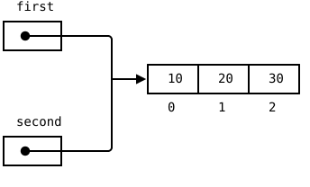
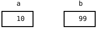

{width=400}

This chapter paints no new picture on the canvas. Instead you play
detective and look inside the boxes of your variables, with four
small experiments that you type yourself. One of them ends with a
result that surprises almost everybody the first time. And two
loose ends from earlier chapters, the `const` array that happily
grows and the `substring` that changes nothing, stop being magic
along the way.

## AI tutor {#sec-tutor-value-reference}

Predictions are the whole point of this chapter, and a prediction
that misses is worth a question. When the canvas shows something
your paper did not, describe both sides to the tutor: what you
expected, what appeared, and which lines you typed. "My two
variables changed together and I don't know why" is exactly the
kind of question this tutor is built for.



## Assignment copies the value {#sec-assignment-copies}

Start with the world you have known since the Variables part.
Open a fresh sketch in the playground and type this program:

```typescript
function setup() {
    createCanvas(400, 200);
    background("black");
    fill("white");

    let a: number = 10;
    let b: number = a;
    b = 99;

    text(a, 50, 50);
    text(b, 50, 80);
}
```

Before you press Run, write two numbers on your sheet of paper,
the one you expect on the upper line of the canvas and the one you
expect on the lower line. Every experiment in this chapter starts
that way.

The canvas shows 10 and 99, and that is what everybody predicts.
The interesting line is `let b: number = a;`. It reads the value
in a's box, which is 10, and puts a copy of that value into b's
box. From then on the two boxes have nothing to do with each
other, so `b = 99` reaches b's box alone.

{width=260}

`number` and `boolean` are **value types**: the box of such a
variable holds the value itself, and an assignment copies that
value. Afterwards there are two independent boxes, always.

**Vary it.** Replace the two numbers with `let a: boolean = true;`
and `let b: boolean = a;`, then set `b = false;` and draw both.
Booleans behave exactly like numbers here.

Hold on to that "obviously 10" for a minute. The next experiment
looks almost the same and does something else.

## The array experiment {#sec-shared-reference}

Now the same shape with an array. Keep the `setup` scaffold with
`createCanvas`, `background`, and `fill`, and replace only the
middle part:

```typescript
const first: number[] = [10, 20, 30];
const second: number[] = first;
second[0] = 99;

text(first[0], 50, 50);
text(second[0], 50, 80);
```

Write the prediction down before you run it, and be honest with
yourself. What does `first[0]` show, and what does `second[0]`
show? Most people write 10 and 99. The canvas shows **99 and 99**.

Here is what really happens. The box of an array variable is far
too small for a whole row of values, and it never holds one. It
holds a **reference**, an arrow that says where the array lives.
The array itself lies somewhere else, on its own.

Look at the picture at the top of this chapter again.
`second = first` copies what sits in first's box, and what sits in
first's box is the arrow. So `second` gets an arrow to the very
same row. One array, two names for it. Arrays are **reference
types**.

The line `second[0] = 99` then touches neither of the two variable
boxes. It follows the arrow and changes element 0 of the one array
that exists. `first[0]` reads that same element through the other
arrow, so it reads 99 as well.

**Vary it, twice.**

1. Add `second.push(40);` after the assignment and draw
   `text(first.length, 50, 110);`. The length is 4, because `push`
   follows the arrow too. Growth is shared, not just element
   changes.
2. Change `first[1]` instead of `second[0]`, and read the value
   back through `second[1]`. It changed the same way. Neither
   variable is the original and neither is the copy; the two
   arrows are worth exactly the same.

## The const puzzle, solved {#sec-const-puzzle}

The bubbles chapter carried a callout named "A const that
changes?" (@sec-empty-array). It said that `const circlesDiameter`
can still be pushed into, because `const` nails the box down while
the content stays free. That was a rule to accept, and now it has
a reason.

`const` forbids exactly one thing, putting something else into the
box. The box of an array variable holds the arrow, so `const`
means "this arrow never changes again". And `push` never changes
an arrow. It follows the arrow and hangs a value on the end of the
row over there, which `const` does not care about.

Add this line to the array experiment and watch the editor:

```typescript
second = [1, 2, 3];
```

The red squiggle appears before you run anything, and the message
is worth two seconds of reading. "Cannot assign to 'second'
because it is a constant." That is the box complaining, not the
array. Delete the line again.

## A real copy takes a loop {#sec-real-copy}

If an assignment only copies the arrow, how do you get a second
array that is truly independent? Three tools you already own are
enough, an empty array, a `for` loop, and `push`. Here they copy
the array `first` from the array experiment
(@sec-shared-reference):

```typescript
const copy: number[] = [];
for (let i: number = 0; i < first.length; i++) {
    copy.push(first[i]);
}
```

Read the shape of it. The `[]` creates a brand new array, so
`copy` starts with a brand new arrow to a row of its own. The loop
then walks the old row and pushes every element into the new one,
and each of those elements is a number, a value type, so each
`push` copies a value across. Two rows, two arrows, no connection.

**Try it.** Put the loop into the array experiment, add
`copy[0] = 0;` below it, and draw `first[0]` and `copy[0]` under
each other. This time the two numbers differ, and now you can say
exactly why.

::: {.callout-note}
## Comparing arrays compares the arrows
`===` between two array variables asks whether the two boxes hold
the same arrow, not whether the two rows look alike. For the two
variables of the array experiment, `first === second` is `true`,
because both arrows lead to one array. But `first === copy` is
`false` even when every single element matches, because those
arrows lead to two different rows. Comparing contents takes a loop
as well.
:::

## Strings: a row you can never change {#sec-strings-immutable}

A string looks exactly like the array picture. It is a row of
boxes, the indexes start at 0, `word.length` counts them, and
`word[i]` reads one of them. So does a string variable hold an
arrow too?

Replace the middle part of the scaffold once more, and write your
prediction down before you run it:

```typescript
let word: string = "apple";
let copy: string = word;
word = word + "s";

text(word, 50, 50);
text(copy, 50, 80);
```

The canvas shows "apples" and "apple". The string behaved like the
two numbers at the start of this chapter (@sec-assignment-copies),
not like the shared array (@sec-shared-reference).

The reason is a rule without exceptions. No operation ever changes
an existing string. `word + "s"` does not append an "s" to
anything; it builds a completely new string `"apples"`, and the
assignment puts that new string into word's box. What `copy` holds
is the old string, untouched, because nothing was ever able to
touch it.

You have met that rule once before without a name. Word Swirrel
said that `substring` never changes the string it is called on and
hands you a copy of the piece instead (@sec-substring-cut). Every
string method works that way.

Type one more line and let the compiler show you the rule:

```typescript
word[0] = "A";
```

Reading a character with `word[0]` is allowed, writing one is not.
The squiggle says "Index signature in type 'String' only permits
reading". Delete the line again.

Now the two words for all of this. An array can be changed after
it is created, with `push`, `splice`, or a write through an index,
so an array is **mutable**. A string can never be changed after it
is created, so a string is **immutable**, and every string
operation that looks like a change really hands back a new string.
Because nothing can ever change a string, sharing one is harmless.
A string variable behaves like a value type in every assignment,
and JavaScript indeed files strings with the value types, next to
`number` and `boolean`.

::: {.callout-note}
## Strings in other languages
Other languages model strings differently under the hood. In C#
and in Java, a string variable does hold an arrow, and the thing
at the end of the arrow is immutable. A running program cannot
tell the two models apart, and immutability is the reason: when
nothing can change the thing the arrow leads to, it makes no
difference whether an arrow is there.
:::

## Check your understanding {#sec-quiz-value-reference}

When your predictions and the canvas agree, and you can say out
loud what `second = first` copies, take the short quiz below. You
answer six questions about this chapter in your own words, and an
AI reads your answers and tells you what you already understand
and what you should read again. The quiz is anonymous, and
answering in German is fine too.


