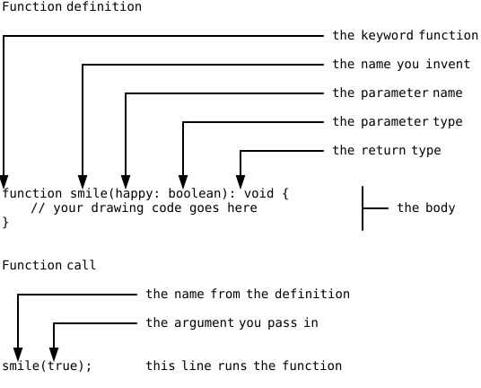

{width=380}

You have been writing code inside functions since your very first
program. `setup` is a function, `draw` is a function, and
`mouseClicked` is one as well. What you have never done is build one
of your own. This part of the book changes that. You'll learn to
teach the computer new commands, give them names, hand them values to
work with, and grow big programs out of small named pieces instead of
one long block of statements. The first command you invent draws a
smiley face.

In the Arrays part, Word Swirrel handed you a finished line,
`function guess(textInput: string)`, and asked you to fill in nothing
but the body (@sec-guess-function). The book left that line
unexplained on purpose and promised a later part for it. This is that
part. Back then the signature was given to you; today you write your
own.

## AI tutor {#sec-tutor-face-function}

Your first own function brings two new kinds of mistakes. A function
that is defined but never called draws nothing at all, and a function
called with the wrong value draws the wrong thing. If your canvas
stays empty or every face looks the same, paste your definition and
your call and tell the tutor what you expected.



## A function is a command you teach {#sec-what-is-a-function}

You already give the computer commands all day. `circle(200, 200, 50)`
is one, `fill("yellow")` is another. Those commands come with p5.js,
someone else wrote them, and you use them by writing their name and a
pair of parentheses.

A function of your own works exactly the same way, with one
difference. You write the recipe. You collect a group of statements
under a name you invent, once, and from then on that name is a command
like `circle` or `fill`. Writing the recipe down is called
**defining** the function. Saying the name later to make it run is
called **calling** it.

Defining and calling are two separate things, and the order on the
page does not matter. A definition anywhere in your file can be called
from anywhere else, even from a line above it.

A function also changes what you do when a program needs the same
work twice. Back in the cat chapter, copying a line and changing its
numbers was the fastest way to draw a second ear (@sec-clipboard),
and the clipboard stays a useful typing tool for that. Copying a
whole *block* of statements is a different story. Ten pasted lines
are ten places to fix when the drawing changes, and the reader of
your program has to compare them character by character to see what
is different. From this part on, work that repeats gets a name and
becomes a function, and the copies become calls.

## The anatomy of a function {#sec-function-anatomy}

A function definition and a function call look similar, and they have
different jobs. Here are both, with every part named:

{width=520}

The definition starts with the keyword `function`, then the name you
invent, then a pair of parentheses, then the body between braces. The
body is the recipe, the statements that run whenever somebody calls
the function.

Inside the parentheses of the definition sits `happy: boolean`. That
is a **parameter**, a variable that exists only inside this function
and has no value of its own. Whoever calls the function decides what
goes in.

Inside the parentheses of the call sits `true`. That is an
**argument**, the value that fills the parameter for this one run.
Parameter and argument are two names for the two ends of the same
handover. The parameter is written in the definition, the argument is
written in the call, and the argument's type has to match what the
parameter asks for.

When the computer reaches `smile(true);` it does not simply read on.
It remembers where it was, jumps into the body of `smile`, runs the
statements there from top to bottom, and then comes back to the line
right after the call. Your program continues as if nothing had
happened, only a face has appeared on the canvas.

## A complete signature, every time {#sec-signature-rule}

The first line of a function definition is called its **signature**.
The signature says the name, what the function needs, and what it
gives back. In `function smile(happy: boolean): void`, the part
`happy: boolean` is what the function needs, and `: void` is what it
gives back.

`void` means "nothing". The `smile` function draws on the canvas and
then it is done; it hands no value back to whoever called it. Not
every function is like that, and a later chapter of this part shows
functions that answer with a value. Until then, every function you
write ends its signature with `: void`.

::: {.callout-important}
## Course rule: every function gets a complete signature
Every function you write in this course names a type for each
parameter and a type for the result. That is the "every variable gets
a type" rule from the Variables part, applied to functions. Now you
can also read the line you have typed a hundred times without
understanding it, because `function setup(): void` says exactly that:
no parameters, nothing given back. Loop variables carry their type
in the same spirit (@sec-while-four-steps), so a for header reads
`for (let i: number = 0; i < 10; i++)`.
:::

## One function, two faces {#sec-happy-or-sad}

A parameter is worth the trouble because it makes one function do
several jobs. The `smile` function takes a single boolean, and that
boolean decides between a happy face and a sad one:

```typescript
function smile(happy: boolean): void {
    stroke("black");
    strokeWeight(10);
    if (happy) {
        fill("yellow");
    } else {
        fill("lime");
    }

    circle(200, 200, 350);

    fill("black");
    circle(125, 125, 20);
    circle(275, 125, 20);

    noFill();
    if (happy) {
        arc(200, 250, 200, 150, 0, 180);
    } else {
        arc(200, 300, 200, 150, 180, 360);
    }
}
```

The condition is written as `if (happy)`, without a comparison. A
boolean already is the answer to a yes-or-no question, so there is
nothing left to compare it against. Writing `if (happy === true)`
works too and says the same thing twice.

Two decisions and one function, and the caller picks a face with a
single word. Without the parameter you would need two functions,
`drawHappyFace` and `drawSadFace`, with almost identical bodies. Every
time you changed the eyes you would have to change them twice. That is
what parameters are for.

## Drawing at a fixed spot, appearing anywhere {#sec-face-origin}

Look at the numbers in the face above. The eyes sit at 125 and 275,
the head is a circle of diameter 350 around (200, 200). Those numbers
never change, so on its own this face would always land in the same
corner of the canvas at the same size. The move that frees it is one
you know from the Loops part, where the origin started to wander
(@sec-translate-relative):

```typescript
function smile(happy: boolean): void {
    push();
    translate(random(0, width), random(0, height));
    scale(0.2);

    // ... the drawing code from above ...

    pop();
}
```

`translate` moves the origin to a random point of the canvas, so the
fixed coordinate (200, 200) now means "200 to the right and 200 down
from there". `scale(0.2)` multiplies every following coordinate and
length by 0.2 (@sec-scale-multiplies), which turns a 350 pixel head
into a 70 pixel one. The `push` and `pop` around them put the
coordinate system back the way it was (@sec-push-pop), so the next
call starts from the same place as the first one.

Here is the habit worth taking from this chapter. A function that
draws with fixed numbers can still draw anywhere, because a
`translate` in front of the drawing decides where those numbers land.
Every drawing function in this part is built like that.

## Flipping a boolean back and forth {#sec-face-toggle}

The finished program should alternate, so a happy face, then a sad
one, then a happy one again. Alternating means the program has to
remember what it drew last, and a variable that survives between two
mouse clicks lives outside every function:

```typescript
let nextSmiling: boolean = true;

function mouseClicked(): void {
    nextSmiling = !nextSmiling;
    smile(nextSmiling);
}
```

`nextSmiling` is declared outside the braces of any function, so
`setup` and `mouseClicked` both see the same variable. The line
`nextSmiling = !nextSmiling;` flips it with the `not` operator you met
in the parsing chapter (@sec-previous-point). A `true` becomes
`false`, a `false` becomes `true`, and the value goes straight back
into the variable it came from. That single line is the standard way
to toggle a boolean, and you will write it often.

## Your exercise: Face Function {#sec-face-function-exercise}

The starter code contains the signature of `smile` and one call in
`setup`, both with the parts labeled in comments. Your job is the body
and the clicking.

1. **Read the starter code.** Find the definition, find the call, and
   say out loud which is which. The comment arrows point at the same
   parts as the anatomy figure above (@sec-function-anatomy).
2. **Draw one happy face.** Fill the body of `smile` with the head,
   the two eyes, and the smiling arc, using the fixed coordinates from
   this chapter. Ignore the `happy` parameter for a moment and run the
   program; one face has to appear before anything else is worth
   trying.
3. **Wrap it in push, translate, and scale**, so the face lands at a
   random position and comes out small. Run it a few times and watch
   the face jump around.
4. **Use the parameter.** Add the two `if (happy)` decisions for the
   fill color and the mouth arc. Test both faces by calling
   `smile(true);` and then `smile(false);` in `setup`.
5. **Add the clicking.** Write `mouseClicked` and call `smile` from
   it. Only then add `nextSmiling` above all functions, flip it in
   `mouseClicked`, and hand it to both calls, the one in `setup` and
   the one in `mouseClicked`. One change, one run, exactness first.
6. **Experiment.** Give the sad face a different color, change
   `scale(0.2)` to `scale(0.5)`, or call `smile` three times in
   `setup` and see three faces from one function.



## Check your understanding {#sec-quiz-face-function}

When your canvas fills with faces and you can point at a definition
and a call and name them correctly, take the short quiz below. You
answer six questions about this chapter in your own words, and an AI
reads your answers and tells you what you already understand and what
you should read again. The quiz is anonymous, and answering in German
is fine too.


