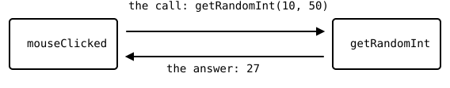

{width=470}

Every function you have written so far was a painter. You handed
it a few values, it drew something, and that was the end of the
story. This chapter adds the missing direction. A function can
also work out an answer and hand it back to the code that called
it, and once it can do that, you can wrap any calculation you use
often into a tool with a name.

## AI tutor {#sec-tutor-return-values}

The word `return` looks harmless and hides two effects at once, so
if a line after your `return` never seems to run, that is worth
asking about. Describe to the tutor what your function should hand
back, what type you wrote after the parentheses, and what the
editor underlines.



## A function that hands a value back {#sec-return-value}

Up to now, every function you wrote ended its signature with
`: void`, which is the promise "I give nothing back". A function
that answers replaces `void` with the type of its answer:

```typescript
function getRandomInt(min: number, max: number): number {
  return floor(random(min, max));
}
```

Read the head from left to right. The function is called
`getRandomInt`, it wants two numbers, and after the closing
parenthesis stands `number`, so it hands a number back. The
course rule for signatures has not changed (@sec-signature-rule),
every parameter and the result still get a type. Only the result
type is no longer `void`.

The word `return` does two things in one move. It works out the
value on its right and hands that value to whoever called the
function, and it ends the function immediately. You have seen the
second half of that before, as a bare `return;` that left
`mouseClicked` early (@sec-hit-testing). The version with a value
behind it is the same jump, only with luggage.

::: {.callout-warning}
## Nothing after the return runs
Statements below a `return` in the same block are never executed.
If you write a `return` in the middle of a function and wonder why
the drawing below it stays invisible, that is why. Compute first,
return last.
:::

## The call jumps away and comes back {#sec-call-and-return}

You know the jump from the definition chapter
(@sec-function-anatomy). The computer remembers where it was,
runs the body of the function, and comes back to the line after
the call. A function with a return value makes that trip in both
directions. The arguments travel over, the function works, and the
answer travels back to exactly the spot where the call stood:

{width=470}

That is why a call to such a function can stand wherever a value
is allowed. It behaves like a number:

```typescript
const diameter: number = getRandomInt(10, 50);
```

The right side of the assignment is not "a function", it is
whatever `getRandomInt` handed back, so `diameter` ends up holding
a plain number like 27. The same call could sit inside a `circle`
call or inside a calculation, in every place where you could have
typed 27 yourself.

## One recipe, one name {#sec-get-random-int}

Look at what the body of `getRandomInt` actually does. Nothing in
it is new, because `floor(random(min, max))` is the dice recipe
from the Conditions part (@sec-floor), which turns a random
decimal into a whole number. What is new is that the recipe now
has a name.

Naming an idea is what makes it reusable. The program of this
chapter needs random whole numbers three times, and thanks to the
name, all three read like plain sentences:

```typescript
function mouseClicked(): void {
  const centerX: number = getRandomInt(0, width);
  const centerY: number = getRandomInt(0, height);
  const diameter: number = getRandomInt(10, 50);
  circle(centerX, centerY, diameter);
}
```

Three calls, one shared body. If you ever decide that the numbers
should be rounded differently, you change one line in one place
and all three calls follow. And a reader who has never seen your
program understands `getRandomInt(10, 50)` at a glance, while
`floor(random(10, 50))` always needs a moment of thought.

The bounds are not symmetric, and that is worth knowing before you
use the tool. `random(10, 50)` produces a decimal that is at least
10 and always stays below 50, and `floor` then cuts the decimals
away. So `getRandomInt(10, 50)` gives you 10 at the lowest and 49
at the highest. The lower bound is included, the upper bound is
not, exactly like the last index of an array is `length - 1`.

## Doc comments explain a function to its user {#sec-doc-comments}

A function you want to reuse deserves one more thing, a comment
that describes it from the outside. TypeScript has a special
comment form for that, written above the function and starting
with `/**`:

```typescript
/**
 * Helper function to get an integer random number between min and max
 * @param min Minimum value (inclusive)
 * @param max Maximum value (exclusive)
 * @returns Random integer between min and max
 */
function getRandomInt(min: number, max: number): number {
  return floor(random(min, max));
}
```

The first line says what the function is for. Each `@param` line
explains one parameter by name, and `@returns` describes the
answer. Notice that the comment is the place where "inclusive" and
"exclusive" get written down, because the signature alone cannot
say it.

The payoff is immediate. Type `getRandomInt(` somewhere in the
playground editor and stop, or point the mouse at a call you
already wrote. The editor shows your own text in a small box,
right where you need it. This is where all those helpful tooltips
for `random` and `circle` come from, and from this chapter on your
own functions get them too.

## Your exercise: Return Values {#sec-return-values-exercise}

This exercise is a type-in. The complete program is in the
exercise description as a picture, and the pieces are all in the
sections above.

1. **Type in the program.** The starter code already contains
   `setup` with the black background and the lime outline. Add
   `getRandomInt` with its doc comment, then `mouseClicked` with
   the three calls and the `circle`. Type it, don't paste it.
2. **Hover over your own call.** Point the mouse at
   `getRandomInt` inside `mouseClicked` and read the box that pops
   up. Then change one word in the doc comment and hover again.
3. **Play computer.** On paper, answer these three questions for
   `getRandomInt(10, 50)`. What is the smallest number it can
   hand back, what is the largest, and what does `random` produce
   if the answer turns out to be 27?
4. **Watch the circles pile up.** Click ten times. Nothing repaints
   the background after `setup`, and the program has no `draw`, so
   every circle stays where it was painted.
5. **Experiment.** Give the circles a random line color by writing
   a second function that returns a color name, or make the
   diameter depend on the position by passing `centerY` into a
   function of your own. Whatever you build, keep the rule: one
   function, one job, one clear answer.



## Check your understanding {#sec-quiz-return-values}

When your circles appear on every click and you can explain what
`return` hands back and where it hands it to, take the short quiz
below. You answer six questions about this chapter in your own
words, and an AI reads your answers and tells you what you already
understand and what you should read again. The quiz is anonymous,
and answering in German is fine too.


