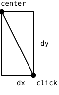

{width=320}

Bubbles are back. In the Arrays part you built a program where
bubbles appeared, waited, and burst on their own
(@sec-bubbles-exercise); this chapter turns the same bubbles into a
game you play with the mouse. The bubbles have not changed, the
engine underneath them has. Everything the program does now lives in
a function with a name, and each of those functions has exactly one
job.

## AI tutor {#sec-tutor-bubble-buster}

Bubble Buster is the first program in this course where five or six
of your own functions work together, so a bug can hide in the
cooperation instead of in a single line. If a click pops the wrong
bubble or nothing happens at all, tell the tutor which function you
think is responsible and paste it.



## The same bubbles, a new engine {#sec-bubble-engine}

Bubble Buster keeps its bubbles in three parallel arrays, one for
each thing a bubble needs:

```typescript
const circlesX: number[] = [];
const circlesY: number[] = [];
const circlesDiameter: number[] = [];
```

Three arrays instead of the five from the Arrays part, because a
bubble in this game has no color of its own and no lifetime. Every
bubble is drawn with the same lime outline, and bubbles disappear
when the player pops them, not when a clock says so.

The clock changes too. In the Arrays part, `draw` compared
`millis()` against a deadline sixty times a second (@sec-millis).
Bubble Buster hands that job to `setInterval` instead
(@sec-intervals-exercise), so `draw` never thinks about time at all:

```typescript
circleInterval = setInterval(addRandomCircle, waitingTime);
```

Remember the rule for handing a function over. `addRandomCircle`
without parentheses passes the function itself; with parentheses
you would call it once yourself and hand over its result.

## One function, one job {#sec-bubble-one-job}

The guiding idea of this chapter is small enough to write on one
line. Every function you write does one job, and its name says which
one. When you can describe a function's job without the word "and",
the split is right.

Look at the first job, creating a bubble. It needs nothing from the
caller, and it gives nothing back; it just adds one bubble to the
arrays:

```typescript
/**
 * Helper method that adds a random circle to the screen.
 */
function addRandomCircle(): void {
  circlesX.push(random(width));
  circlesY.push(random(height));
  circlesDiameter.push(random(10, 50));
}
```

No parameters between the parentheses, and `: void` as the return
type, because there is no answer to hand back. The function reaches
straight into the global arrays, which is exactly why it works both
as an interval callback and as a normal call from `setup`.

Drawing the bubbles is a different job, and it stays in `draw`,
which wipes the canvas each frame and repaints every bubble the
arrays remember.

## Answering a question: isInside {#sec-bubble-hit-test}

The second function has the opposite shape. It takes three values
in, it draws nothing, and it hands back an answer. The question it
answers is whether a point lies inside a bubble, and the answer is a
`boolean`.

A point is inside a circle when its distance from the center is
smaller than the radius, so the function needs that distance. The
click and the center form a right triangle, with one horizontal leg
and one vertical leg:

{width=170}

The Pythagorean theorem from math class turns the two legs into the
diagonal, so `a * a + b * b` is the square of the distance and
`sqrt` brings it back down to a length:

```typescript
/**
 * Helper method that checks if a point is inside a circle.
 * @param x The x-coordinate of the point.
 * @param y The y-coordinate of the point.
 * @param circleIndex The index of the circle in the circles array.
 * @returns True if the point is inside the circle, false otherwise.
 */
function isInside(x: number, y: number, circleIndex: number): boolean {
  const dx: number = x - circlesX[circleIndex];
  const dy: number = y - circlesY[circleIndex];
  const distance: number = sqrt(dx * dx + dy * dy);
  return distance < circlesDiameter[circleIndex] / 2;
}
```

The last line deserves a slow read. The comparison
`distance < circlesDiameter[circleIndex] / 2` produces `true` or
`false`, and `return` hands that value straight to whoever asked.
The diameter is halved because the radius is what a distance has to
beat.

Note the third parameter. `x` and `y` are a point anywhere on the
canvas, while `circleIndex` says which bubble to compare against, so
the bubble data stays in the arrays where it belongs.

::: {.callout-note}
## p5.js could do this for you
p5.js has a built-in function `dist(x1, y1, x2, y2)` that computes
the distance between two points in one call. Bubble Buster does the
math by hand on purpose, because the Pythagorean theorem shows up in
graphics programming again and again. Once you have seen it work,
`dist` is a fair shortcut in your own projects.
:::

## Popping bubbles, backwards {#sec-bubble-pop}

Clicking is handled by `mouseClicked`, the callback p5.js calls for
you. It walks all bubbles, asks `isInside` about each one, and
removes the ones that were hit:

```typescript
function mouseClicked(): void {
  for (let i = circlesX.length - 1; i >= 0; i--) {
    if (isInside(mouseX, mouseY, i)) {
      circlesX.splice(i, 1);
      circlesY.splice(i, 1);
      circlesDiameter.splice(i, 1);
      points++;
    }
  }
}
```

The loop header runs from `length - 1` down to 0, and that is the
same rule you met with the bursting bubbles (@sec-splice). Any loop
that may `splice` elements out of the array it is walking has to
walk backwards, or it silently skips the element that slid into the
freed index.

Two overlapping bubbles under one click are both removed, because
the loop keeps going after a hit. Every removal also raises
`points`, which `draw` prints in the top left corner.

## Stopping the game {#sec-bubble-stop}

Bubbles that nobody pops pile up, and when ten of them are on the
canvas the game is over. The check belongs at the very top of
`draw`, before any drawing happens:

```typescript
function draw(): void {
  background("black");

  // If more than 10 circles are on the screen, stop the game.
  if (circlesX.length >= 10) {
    stopGame();

    // Note that the return statement stops the execution of the function.
    return;
  }

  // ... draw the bubbles and the score ...
}
```

A bare `return;` inside a `void` function means "I am done here".
The rest of `draw` never runs, so the game over screen that
`stopGame` painted stays on the canvas instead of being covered by
bubbles.

`stopGame` clears both intervals, paints the final message, and ends
with a p5.js function that is new here, `noLoop()`. A call to
`noLoop()` tells p5.js to stop calling `draw` altogether, so `draw`
stops running sixty times a second just to check the same `if`
forever. Its partner is `loop()`, which starts the calls again, for
example when you add a restart to the game.

## Leveling up by replacing an interval {#sec-bubble-levels}

The game gets harder over time, and the trick is that an interval
can be thrown away and replaced. A second interval fires every ten
seconds and does exactly that:

```typescript
/**
 * Helper method that is called when the player advances to the next level.
 */
function nextLevel(): void {
  clearInterval(circleInterval);
  waitingTime /= 2;
  circleInterval = setInterval(addRandomCircle, waitingTime);
}
```

Three lines, one job. `clearInterval` stops the old bubble timer,
`waitingTime /= 2` halves the pause, and `setInterval` starts a new
timer with the shorter pause. Storing the new id back into
`circleInterval` matters, because the next level has to be able to
stop the timer that is actually running.

## Your exercise: Bubble Buster {#sec-bubble-buster-exercise}

The starter code gives you the three arrays, the timer variables,
the score, and empty `setup` and `draw` functions. Everything else
is yours, and the exercise description lists five tasks. Work
through them in order and run the program after each one.

1. **Random bubbles.** Write `addRandomCircle` as described in
   @sec-bubble-one-job, call it once in `setup` so the first bubble
   is there immediately, and start the interval that calls it every
   three seconds. Draw all bubbles in a loop in `draw`.
2. **Popping.** Write `isInside` with its three parameters and its
   `boolean` return value, then write `mouseClicked` with the
   backwards loop that splices out every bubble under the pointer.
3. **Points.** Count each popped bubble and print the score in the
   top left corner with `text`.
4. **Levels (advanced).** Add the second interval that calls
   `nextLevel`, so the bubbles come twice as fast every ten seconds.
5. **Game over (advanced).** Add the early `return;` in `draw` and
   the `stopGame` function that clears both intervals, shows the
   final score, and calls `noLoop()`.



When your game runs, read the sample solution and compare its
decomposition with yours. That comparison is the real lesson here.

## Check your understanding {#sec-quiz-bubble-buster}

When your bubbles pop under the mouse and you can say out loud what
each of your functions is responsible for, take the short quiz
below. You answer six questions about this chapter in your own
words, and an AI reads your answers and tells you what you already
understand and what you should read again. The quiz is anonymous,
and answering in German is fine too.


