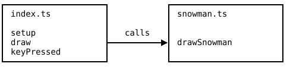

{width=440}

Every program you have written so far lived in a single file called
`index.ts`. That stops here. Melting Snowman is a guessing game in
the style of Hangman, and its code is spread over two files, one for
the game and one for the drawing of the snowman. This chapter builds
the drawing half and, with it, the skill of finding your way around
a program that no longer fits on one screen.

## AI tutor {#sec-tutor-snowman-1}

Two files means a new kind of confusion, because a mistake can look
like it happens in the file you are reading while it really comes
from the other one. When something does not appear on the canvas,
tell the tutor which file you edited and which one you expected to
react.



## Why programs get split into files {#sec-snowman-modularity}

Splitting a program into several files is called **modularity**, and
each file is a module. It costs a little order and pays back three
things.

- **You find things faster.** A snowman drawing bug sends you to
  `snowman.ts`, not into a scroll through 300 mixed lines.
- **Several people can work at once.** One person writes the game
  rules while another person improves the snowman, and nobody
  overwrites anybody.
- **A file can be reused.** A module that only draws a snowman can
  be copied into a Christmas card program without dragging the
  guessing game along.

The rule of thumb is the same one you know from functions. One
function has one job, and one file holds the functions that belong
to one job. Melting Snowman uses `index.ts` for the game itself and
`snowman.ts` for everything that draws the snowman.

## One program on several sheets of paper {#sec-snowman-shared-scope}

In the playground, the files of a program are not separate worlds.
They are one program written on several sheets of paper, and the
computer reads all sheets before it starts. A function defined in
`snowman.ts` can be called from `index.ts` with no extra ceremony,
exactly as if both lines stood in the same file:

{width=460}

The same is true for global variables. A `let` at the top of one
file is visible in all of them, which is convenient and also a
reason to give globals clear names.

::: {.callout-note}
## Real projects say where things come from
Bigger TypeScript projects do not share everything automatically.
There, each file lists what it needs from other files with `import`,
and says what it offers with `export`. The playground leaves that
machinery out so you can concentrate on the split itself, and later
courses pick `import` and `export` up properly.
:::

## Drawing once instead of sixty times a second {#sec-snowman-oneshot}

A snowman does not move. Nothing in this program changes unless the
player presses a key, so repainting the canvas sixty times a second
would burn power to produce the very same picture. Two p5.js
functions give you a program that draws only when there is a reason:

```typescript
function setup(): void {
    createCanvas(800, 500);
    angleMode(DEGREES);

    // Draw the screen one time
    redraw();
    noLoop(); // Stop calling draw() automatically
}
```

`noLoop()` switches the automatic calls to `draw` off. `redraw()`
asks for exactly one call, right now. Together they turn `draw` from
a loop that runs forever into a command you trigger when something
has actually changed. `draw` itself stays a normal `draw`, and you
still never call it directly; you call `redraw()` and p5.js calls
`draw` for you.

## Reacting to the keyboard {#sec-snowman-keys}

Melting Snowman is played on the keyboard, so the program needs a
third callback next to `setup` and `draw`. You have met `keyPressed`
and the variable `key` once before, in the research exercise at the
end of the Variables part (@sec-keyboard-exercise). There you looked
them up in the p5.js reference yourself; from here on they are a
regular part of the course:

```typescript
function keyPressed(): void {
    numberOfKeypresses++;

    // Refresh the screen one time
    redraw();
}
```

p5.js calls `keyPressed` once for every key the player presses, and
inside it the global variable `key` holds the character that was
pressed, as a string. Pressing the A key makes `key` the string
`"a"`, and holding shift makes it `"A"`. This first part of Melting
Snowman ignores which key it was and only counts the presses, so
every key melts the snowman a bit further. The letters start to
matter when the guessing logic arrives.

What is new is the partner that `keyPressed` works with here. The
pairing of `keyPressed` and `redraw()` is the whole event loop of
this program. A key changes a variable, `redraw()` repaints the
canvas once with the new value, and then the program waits again.

## A doc comment as a specification {#sec-snowman-spec}

The file `snowman.ts` already contains a complete `drawSnowman`
function that draws the snowman with all its parts, and above it
sits a doc comment. That comment is not decoration. It is the
specification of what the function is supposed to do, and your task
is to make the code match it:

```
 * * 1 wrong: Lower three buttons
 * * 2 wrong: Upper three buttons
 * * 3 wrong: Left half of mouth
 * * 4 wrong: Nose
 * * 5 wrong: Right half of mouth
 * * 6 wrong: Left eye
 * * 7 wrong: Right eye
 * * 8 wrong: Hat
 * * 9 wrong: Top body part
 * * 10 wrong: GAME OVER
```

Reading a specification carefully is a skill of its own, and one
word in this one carries most of the meaning. The parts left out are
**additive**. Three wrong guesses do not hide the mouth half alone;
they hide the parts for one, two, and three wrong guesses together,
so the snowman keeps melting instead of growing back.

Additive is exactly what a "less than" comparison gives you. The
nose belongs to the number 4, so it is drawn as long as the count
has not reached 4:

```typescript
// Nose
if (numberOfWrongGuesses < 4) {
    push();
    noStroke();
    fill("orange");
    triangle(0, 195, 0, 165, 40, 180);
    pop();
}
```

At zero, one, two, or three wrong guesses the nose appears. From
four on it is gone and stays gone, because no larger number is ever
less than 4. Wrap each part in the comparison that belongs to its
line in the specification and the melting takes care of itself.

Two groups of parts need a different move. The buttons and the mouth
dots are not drawn one by one but by `for` loops that repeat a shape
six times, moving or rotating the origin between rounds. Hiding half
of them means running the loop fewer times rather than putting an
`if` around a single shape, so the number the loop starts at is what
your condition should change.

## Your exercise: Melting Snowman (1) {#sec-snowman-1-exercise}

The starter code is a running program. `index.ts` counts key presses
and hands the count to `drawSnowman`, and `snowman.ts` draws the
complete snowman and ignores the count so far. You change that.

1. **Run it first.** Press a few keys and watch nothing happen. The
   count rises, the picture stays, and that is the gap you close.
2. **Read both files.** Find the call in `index.ts` and the
   definition in `snowman.ts`, and follow the value from the key
   press to the parameter `numberOfWrongGuesses`.
3. **One part at a time.** Start with the nose from
   @sec-snowman-spec, run, and press four keys to check it
   disappears at the right moment. Then do the hat, the eyes, and
   the body parts.
4. **Then the loops.** The mouth and the buttons come last, because
   they need the loop start instead of a plain `if`. Test each of
   them with the exact number from the specification.
5. **Play the whole melt.** Press ten keys in a row and compare
   every step with the list in the doc comment.

::: {.callout-important}
## No sample solution for this exercise
This exercise comes without a sample solution on purpose, so the
specification in the doc comment is your only reference. The next
chapter's exercise gives you a finished `snowman.ts` as part of its
starter code, and comparing it with your version then is worth much
more than reading it now.
:::



## Check your understanding {#sec-quiz-snowman-1}

When your snowman melts key press by key press in the order the
specification demands, take the short quiz below. You answer six
questions about this chapter in your own words, and an AI reads your
answers and tells you what you already understand and what you
should read again. The quiz is anonymous, and answering in German is
fine too.


