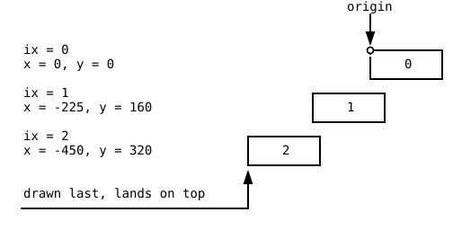

{width=440}

Until now, everything on your canvas came out of p5 drawing commands:
circles, rectangles, lines, text. This chapter hands you a new kind of
building block, the picture file. You load ready-made images into your
program and place them on the canvas, and while you do that you learn
the design idea behind games like the one in the goal picture above.
The tiles fit together so perfectly because of the way they were
rendered, and the second half of this chapter explains exactly why.

## AI tutor {#sec-tutor-orthographic}

Two things go wrong in every first image program. The picture does not
appear at all, or it appears squashed. If your canvas stays empty,
tell the tutor the URL you used and where your `loadImage` call sits;
if the picture looks wrong, describe what you passed to `image`.



## Pictures your program loads {#sec-load-image}

An image is not part of your code. It lives somewhere on the internet,
under an address, and your program has to fetch it before it can draw
it. Fetching takes time, a few milliseconds on a good connection and
much longer on a bad one, so p5 gives you a command that waits for the
picture and hands it over when it has arrived.

```typescript
const BASE_URL: string = "https://cddataexchange.blob.core.windows.net/images/trains";

let railroad: p5.Image;

async function setup(): Promise<void> {
    railroad = await loadImage(`${BASE_URL}/railroad-straight.png`);

    createCanvas(800, 550);
}
```

You met this shape in the melting snowman game, where `setup` loaded a
font the same way. Three parts work together here.

- `loadImage(url)` starts fetching the picture at that address.
- `await` means "wait here until it has arrived". Without it, the next
  line would run while the picture is still on its way, and you would
  draw nothing.
- A function that contains `await` has to be marked `async`, and its
  return type becomes `Promise<void>`. Read that as "this function
  finishes later, and when it does, it returns nothing".

The variable `railroad` has the type `p5.Image`, the type of a loaded
picture. It stands outside `setup` because `draw` needs it too, and it
is declared with `let` because it only gets its value once the image
has arrived.

## Drawing a picture: image {#sec-image-draw}

The command that puts a loaded picture on the canvas is `image`, and
the version this course uses takes five arguments.

```typescript
image(railroad, 0, 0, railroad.width, railroad.height);
```

The first argument is the picture. The next two are the position of
its top left corner, exactly like the top left corner of a rectangle.
The last two are the width and the height the picture gets on the
canvas.

Every `p5.Image` knows its own size, so `railroad.width` and
`railroad.height` are the real pixel size of the loaded file, and
passing those two values draws the picture at its natural size.
Any other pair of numbers stretches or squeezes it. That is a real
tool when you want it (half size, double size) and a common accident
when you don't, because a picture with the wrong proportions looks
subtly broken. When you change one of the two, change the other by the
same factor.

## Two ways to look at the world {#sec-projection}

Now to the design half of this chapter. Every 3D picture, whether it
comes from a camera or from a program, is a flat image of a world that
has depth, and there are two ways to flatten it.

{width=200}

**Perspective** works like your eyes and like a photo camera. Objects
that are farther away appear smaller, and parallel lines (think of
railroad rails running to the horizon) come closer together in the
distance.

{width=175}

**Orthographic** ignores distance. An object keeps its size no matter
how far away it is, and parallel lines stay parallel. Nobody sees the
world this way, which is the point. Technical drawings use it because
you can measure a length directly in the drawing, and 3D printing
software uses it for the same reason.

## Why orthographic tiles can repeat {#sec-tiles-repeat}

A tile-based world is built from a few pictures used over and over.
The goal picture of this chapter is drawn from exactly two images, one
railroad segment and one wagon. Whether that works at all is decided
by the projection.

{width=380}

In the perspective rendering, the segment is wider at the near end
than at the far end, because that is what perspective does. Put a copy
next to it and the wide end meets a narrow end. The rails do not line
up, and no amount of shifting fixes it, because the two ends have
different sizes.

In the orthographic rendering, both ends are equally wide. One copy
ends where the next one begins, so you can build a track of any length
out of a single image file. Classic tile games are built on this. In
the strategy game SimCity 2000, the whole city is assembled from small
orthographic tiles, which is why streets and buildings snap together
across the entire map. You can see a screenshot of it in the
[Wikipedia article about SimCity 2000](https://en.wikipedia.org/wiki/SimCity_2000).

## Drawing from right to left {#sec-right-to-left}

Pictures with a transparent background overlap, and the rule for
overlapping is simple: whatever you draw later covers what is already
on the canvas. In a world seen from an angle, the tile that is nearer
to the viewer has to be drawn later than the tile behind it.

In this railroad world, nearer means further to the left and further
down. So the drawing starts at the top right, at the farthest segment,
and walks left and down toward the viewer.

{width=460}

The starter code sets this up in three lines at the top of `draw`.

```typescript
scale(0.5, 0.5);

translate(850, -100);

for (let i = 0; i < 5; i++) {
    drawRailroad(i);
}
```

`scale(0.5, 0.5)` halves everything, because the rendered images are
large and the canvas is 800 by 550. `translate(850, -100)` moves the
origin to the upper right corner, so that negative x values still land
on the canvas. Both work on the coordinate system, exactly as in the
patterns chapter (@sec-local-coords), and both apply to the numbers
you write afterwards.

The function that draws one segment turns an index into a position.

```typescript
/** Draw a railroad segment */
function drawRailroad(ix: number): void {
    image(railroad, -RAILROAD_WIDTH * ix, RAILROAD_HEIGHT * ix, railroad.width, railroad.height);
}
```

Segment 0 lands at the origin. Segment 1 lands one width to the left
(a negative x) and one height down. The loop counts up, so each new
segment appears nearer to the viewer than the one before, which is
exactly the order the overlap needs.

## Your exercise: Orthographic Rendering {#sec-orthographic-exercise}

The exercise starts with a working track of five railroad segments and
asks you to put a train on it.

1. **Read the starter code.** It contains four constants with the
   sizes of the two images, the `drawRailroad` function explained in
   @sec-right-to-left, and comments starting with `// <<<` at every
   place where your code goes.
2. **Load the wagon.** Add a second `p5.Image` variable and load
   `train-carriage-wood.png` in `setup`, with `await`, like the
   railroad image.
3. **One wagon function.** Write `drawTrainWagon(ix: number): void` in
   analogy to `drawRailroad`, using `WAGON_WIDTH` and `WAGON_HEIGHT`.
   The wagons are smaller than the segments, so they need their own
   step sizes.
4. **Six wagons.** Call it in a loop in `draw`. Six wagons on five
   segments is correct; the wagon step is smaller than the segment
   step.
5. **Three tracks (task 2).** Wrap both loops in an outer loop that
   runs three times and ends with `translate(125, 100);`. Each round
   shifts the origin to the next track, and the two inner loops draw
   the same thing again in the new place.

Images bring failure modes that shapes never had. A typo in the URL,
a forgotten `await`, a size that squashes the picture, and the canvas
stays empty or looks wrong with no error message to read. That is
worth its own helper, and here it is.





## Check your understanding {#sec-quiz-orthographic}

When your three tracks stand on the canvas and you can say why the
wagons had to be drawn from right to left, take the short quiz below.
You answer six questions about this chapter in your own words, and an
AI reads your answers and tells you what you already understand and
what you should read again. The quiz is anonymous, and answering in
German is fine too.


