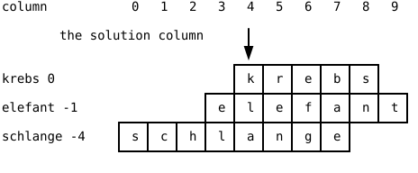

{width=400}

Somebody has always told you which functions to write. The domino
exercise named `drawDice` and `drawDomino`, the temperature chart
listed its four functions, and the train station told you what
`parseTrain` had to return. The crossword task says one thing about
functions and nothing more: do not write all the code in a single
function. Which functions exist and what each does is your decision
now, and that decision *is* the exercise.

## AI tutor {#sec-tutor-crossword}

Designing your own functions feels wobbly the first time, because
there is no single right answer and every exercise before this one
had one. Describe your planned function names to the tutor before
you write code and ask what it thinks of the split. It will not
design the program for you, but it says so when one of your
functions is doing three jobs at once.



## From jobs to functions {#sec-crossword-design}

The method has four steps, and the first one happens on paper.

1. **Say what the program does**, in plain sentences, one per job.
   Not code, not names, just the work.
2. **Turn every sentence into a function.** One job, one function.
3. **Name each function after its job**, so the name answers "what
   does this do?" before anyone reads the body.
4. **Build one function at a time**, run it, look at the canvas.

For the crossword, the sentences come straight out of the task. The
program takes the data apart, paints the yellow column, draws the
cells with the known letters and the hints, reacts to a key,
decides whether that key was a good guess, and decides whether the
player has won. Six sentences, six functions:

| The job | A function for it |
|---------|-------------------|
| Take the data apart into arrays | `function splitInput(): void` |
| Paint the yellow solution column | `function drawSolutionHighlight(): void` |
| Draw cells, known letters, and hints | `function drawCrossword(): void` |
| Show wrong guesses or the win message | `function drawResult(): void` |
| Decide whether a typed key counts | `function isValidGuess(key: string): boolean` |
| Decide whether the game is over | `function hasWon(): boolean` |

: One possible decomposition of the crossword. Your names and your split may differ, and that is allowed. {#tbl-crossword-jobs}

Two kinds of function sit in that table. Four of them *do*
something and return nothing, so their return type is `void`. Two
*answer a question* and return `boolean`, and you can hear it in
the names `isValidGuess` and `hasWon`. `draw` becomes a short list
of orders:

```typescript
function draw(): void {
    background('white');

    drawSolutionHighlight();
    drawCrossword();
    drawResult();
}
```

The order of the three calls is not decoration. The yellow
rectangle goes down first and the cells are painted on top of it,
like the bars-then-axes rule of the temperature chart. Turn the
first two around and the grid vanishes under a yellow block.

Now step 4 pays off. Write `splitInput` alone, draw the parsed
values as text, look, then write the next function. Six checked
steps rarely need a long bug hunt, because you always know which
function you touched last. That is the temperature chart workflow
(@sec-temperature-exercise), applied to your own plan.

## The data: two splits {#sec-crossword-data}

The starter code hands you the crossword as one long string with
one animal per line, here shortened to its first three of 15 lines:

```typescript
const crossword: string = `krebs,0,Schalentier
elefant,-1,Größtes Landtier
schlange,-4,Lautloser Jäger`;
```

Each line holds three fields separated by commas, the animal name,
a start position, and a hint. (The animals and hints are German
words.) Two levels of separators mean two levels of `split`, the
tool from the Sokoban chapter (@sec-sokoban-exercise). Cut the text
into lines, then each line into fields:

```typescript
function splitInput(): void {
    const words: string[] = crossword.split('\n');
    for (let i = 0; i < words.length; i++) {
        const parts: string[] = words[i].split(',');
        animals.push(parts[0]);
        startPos.push(parseInt(parts[1]));
        hints.push(parts[2]);
    }
}
```

The three parallel arrays `animals`, `startPos`, and `hints` are
globals, and after one call of `splitInput` they hold 15 entries
each. `parseInt` turns the middle field into a number, because the
start position is used for arithmetic, not for text.

## Where does each letter go? {#sec-crossword-columns}

The whole picture hangs on one number. The solution word
`klapperschlange` stands vertically in **column 4**, and every
animal name contains one letter of it. The start position says how
far a word is shifted so that its solution letter lands in that
column. `krebs` starts with its `k` and is not shifted, so its
start position is 0. In `schlange` the `a` sits at index 4, so that
word starts four columns further left, at -4.

{width=440}

That gives you the formula for the whole grid. Letter `j` of animal
`i` sits in column `4 + startPos[i] + j` and in row `i`. Multiply
the column by the cell width and the row by the cell height for the
position on the canvas, a job `translate` can do for you:

```typescript
for (let i = 0; i < animals.length; i++) {
    push();
    translate(0, i * letterHeight);
    for (let j = 0; j < animals[i].length; j++) {
        push();
        translate((4 + startPos[i] + j) * letterWidth, 0);
        // draw the cell border, and the letter if it is known
        pop();
    }
    pop();
}
```

Inside the inner `push`, the origin sits in the top left corner of
one cell, so the cell is a plain
`rect(0, 0, letterWidth, letterHeight)` and its letter goes to the
same spot. A function that draws at the origin can draw anywhere,
the rule from the first chapter of this part.

## Does it contain that? includes {#sec-crossword-includes}

The guessing logic asks the same question over and over. Is this
character inside that word, and is it already in the list of
guessed characters? One tool answers both, `includes`, on strings
and on arrays:

```typescript
// 'krebs'.includes('e') is true, 'krebs'.includes('x') is false
// guessedCharacters.includes('e') is true once 'e' was guessed
```

For a string, `includes` asks whether the text contains that piece
of text, and for an array whether one of the elements is that
value. Both answer with a `boolean`, so both fit into an `if`. A
guess is worth something when the character appears in at least one
animal name and has not been guessed before:

```typescript
function isValidGuess(key: string): boolean {
    for (let i = 0; i < animals.length; i++) {
        if (animals[i].includes(key) && !guessedCharacters.includes(key)) {
            return true;
        }
    }
    return false;
}
```

The loop stops at the first animal that contains the character,
because `return true` leaves the function immediately, and only
when no animal matched does the program reach the last line and
answer `false`. Return early on a hit, return the opposite after
the loop: that shape fits every "is there any element with ..."
question. The win check is the same shape upside down, because one
missing letter is enough to answer `false`:

```typescript
function hasWon(): boolean {
    for (const letter of solution) {
        if (!guessedCharacters.includes(letter)) {
            return false;
        }
    }
    return true;
}
```

`for...of` walks arrays, and it walks strings too, one character
per round. It beats a counting loop here, because the function
needs every letter but never an index.

## One key, one guess {#sec-crossword-keys}

The player types, so the program listens with `keyPressed` and
reads the character out of `key`, the pair from the melting snowman
(@sec-snowman-1-exercise). The handler stays tiny, because both
decisions already live in functions:

```typescript
function keyPressed(): void {
    if (!hasWon()) {
        if (isValidGuess(key)) {
            guessedCharacters.push(key);
        } else {
            wrongGuesses++;
        }
    }
}
```

Read it as a sentence. If the game is still running and the guess
is valid, remember the character, otherwise count a wrong guess.
Both ways of guessing wrong, a character in no animal name and one
that was already used, end in the `else` branch, because
`isValidGuess` answers `false` for both. The typed character
travels into `isValidGuess` as an argument, and the parameter there
is called `key` as well, which is allowed and common. Notice that
nothing here draws. The handler changes the data, and the next
frame of `draw` paints the new truth.

## Your exercise: Crossword {#sec-crossword-exercise}

Levels 1 and 2 build the picture, levels 3 and 4 are the advanced
ones that make it a game.

1. **Plan first, on paper.** Write your list of jobs in plain
   sentences, then a function name for each, with its parameters
   and its return type. Five minutes here save an hour later.
2. **Check the columns on paper.** Take `schlange` with start
   position -4 and write down the column of each of its eight
   letters using `4 + startPos[i] + j` (@sec-crossword-columns).
   Does the `a` land in column 4? A wrong idea of the start
   position puts every cell in the wrong place.
3. **Level 1: the empty grid.** Parse the data, then draw the
   yellow column, the empty cells at their computed positions, and
   the hints on the right. Run right after the parser and show
   `animals.length` on the canvas, so you know the arrays are full.
4. **Level 2: all letters visible.** Draw every letter into its
   cell, with no guessing logic yet. Now you can check the
   alignment, because the solution word must read downwards in the
   yellow column.
5. **Level 3 (advanced): guessing.** Start with an empty
   `guessedCharacters` array, show a letter only when the array
   contains it, and add `keyPressed` and `isValidGuess`.
6. **Level 4 (advanced): counting and winning.** Count the wrong
   guesses, show the number below the grid, and write `hasWon` so
   the message becomes a victory line.



## Check your understanding {#sec-quiz-crossword}

When your crossword fills up letter by letter, take the short quiz
below. You answer six questions about this chapter in your own
words, and an AI reads your answers and tells you what you
understand and what you should read again. The quiz is anonymous,
and answering in German is fine too.


