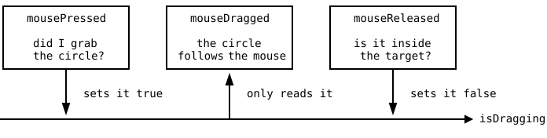
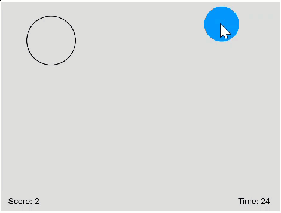

{width=400}

You grab things with the mouse every day. You move a file into a
folder, pull a photo into a chat, drag a window across the screen.
That move is called **drag and drop**, and the Target Game builds
it from scratch. A filled circle waits somewhere on the canvas, an
empty target circle waits somewhere else, and you have 60 seconds
to drag the filled circle into the target as often as you can.

## AI tutor {#sec-tutor-target-game}

Drag and drop breaks in ways that are hard to read from the canvas,
because a circle that does not move looks exactly like a circle
whose hit test is wrong. Tell the tutor which of the three mouse
functions you are working on and what happens when you press, move,
and release. This exercise is an exam task, so the tutor gives
hints instead of finished code, which is what you want here anyway.



## Three moments and one variable {#sec-drag-and-drop}

Dragging looks like one smooth movement, but for the program it is
three separate moments, and p5 has a function for each of them.
`mousePressed` runs the moment a button goes down, `mouseDragged`
runs on every mouse movement while the button stays down, and
`mouseReleased` runs when the button comes back up. None of them
knows anything about the others, and that is the problem to solve.

{width=560}

The connection is a single global variable, a `boolean` that
remembers whether a drag is going on right now. The circle's own
position lives in two more globals, `circleX` and `circleY`, and
`grabbedTheCircle` is the hit test you build in the next section:

```typescript
let isDragging: boolean = false;

function mousePressed(): void {
    if (grabbedTheCircle(mouseX, mouseY)) {
        isDragging = true;
    }
}

function mouseDragged(): void {
    if (isDragging) {
        circleX = mouseX;
        circleY = mouseY;
    }
}

function mouseReleased(): void {
    isDragging = false;
}
```

Read the three bodies as one sentence. Pressing on the circle turns
the drag on, moving the mouse takes the circle along as long as the
drag is on, and releasing turns it off again. Without the variable,
`mouseDragged` would have no way of telling a real drag from a
mouse that was pressed somewhere else on the canvas, and the circle
would jump under the pointer whenever you swipe across the canvas.

State that lives between events is the idea worth keeping from this
chapter. Every drag and drop you have ever used works this way, and
so does the rest of the game. The score, the remaining time, and
the positions of both circles are variables, and `draw` paints
whatever they currently say.

::: {.content-visible unless-format="pdf"}
{width=340}
:::

::: {.content-visible when-format="pdf"}
{width=340}
:::

## Did I grab the circle? {#sec-target-grab}

`mousePressed` has to answer one question before anything moves.
Is the mouse pointer inside the filled circle? That is the hit test
from Bubble Buster (@sec-bubble-buster-exercise), the point in a
circle. Measure the distance between the pointer and the center of
the circle, and compare it to the radius. Anything shorter than the
radius lies inside.

The distance comes from the Pythagorean theorem, and it is worth
its own function, because the game needs it three times:

```typescript
function distance(x1: number, y1: number, x2: number, y2: number): number {
    return sqrt(pow(x2 - x1, 2) + pow(y2 - y1, 2));
}
```

The two differences are the legs of a right triangle and the
distance is its hypotenuse. With that tool in hand, the grab test
is one comparison:

```typescript
distance(mouseX, mouseY, circleX, circleY) <= CIRCLE_RADIUS
```

Compare this with the button hit test of the silo dashboard
(@sec-hit-testing), where four comparisons boxed the mouse into a
rectangle. Round shapes are easier, because a circle asks only one
question, and that is how far away the point is.

## Fully inside: a circle in a circle {#sec-circle-in-circle}

Dropping is a harder question than grabbing. The player scores only
when the filled circle lies **completely** inside the target, so a
circle that pokes over the outline is not enough. One line decides
it:

```typescript
distance(circleX, circleY, targetX, targetY) + CIRCLE_RADIUS <= TARGET_RADIUS
```

Think about the point of the filled circle that sits farthest away
from the target's center. It lies one radius behind the center of
the filled circle, so its distance from the target center is the
distance between the two centers plus `CIRCLE_RADIUS`. When even
that point stays within `TARGET_RADIUS`, every other point does
too.

Two tests, two formulas. A *point* is inside a circle when its
distance is at most the radius. A *circle* is inside a circle when
the centers' distance plus the small radius is at most the big
radius. Mixing them up gives a game that scores far too easily.

::: {.callout-warning}
## Radius in the task, diameter in the code
The task speaks about radii, 50 pixels for the filled circle and 70
for the target, but p5's `circle(x, y, d)` wants a **diameter** as
its third number. Write `circle(circleX, circleY, CIRCLE_RADIUS * 2)`,
and keep the constants as radii, because every distance comparison
in the game needs radii. A circle that looks half the size of the
picture is almost always this mistake.
:::

## Random positions that behave {#sec-target-positions}

Both circles start at random positions, and both have rules. A
circle must be fully visible, so its center keeps one radius of
distance from every edge, which `random` with a range takes care
of:

```typescript
let x: number = random(TARGET_RADIUS, width - TARGET_RADIUS);
let y: number = random(TARGET_RADIUS, height - TARGET_RADIUS);
```

The target also must not overlap the filled circle, at the start
and after every point. Two circles stay apart when the distance
between their centers is larger than the two radii together, so
draw a random position and check it, and if it fails, draw another
one:

```typescript
while (distance(x, y, circleX, circleY) < CIRCLE_RADIUS + TARGET_RADIUS) {
    x = random(TARGET_RADIUS, width - TARGET_RADIUS);
    y = random(TARGET_RADIUS, height - TARGET_RADIUS);
}
```

Keep drawing until the position is good: that is the loop pattern
for any random value with a condition attached. One warning about
packing this into a function. A function returns one value, not
two, so a position finder either returns a `number[]` with the x
and the y in it, like the array-returning functions of the train
station, or you write two smaller functions instead.

## The clock: 60 seconds {#sec-target-timer}

The game ends after 60 seconds, and the remaining time counts down
on the canvas. That is a job for `setInterval` from the callbacks
chapter (@sec-intervals-exercise), which calls a function of yours
once per second:

```typescript
const GAME_SECONDS: number = 60;
let remainingSeconds: number = GAME_SECONDS;
let timer: number;

function setup(): void {
    createCanvas(800, 600);
    timer = setInterval(countDown, 1000);
}

function countDown(): void {
    remainingSeconds--;
    if (remainingSeconds <= 0) {
        clearInterval(timer);
    }
}
```

`setInterval(countDown, 1000)` hands the function over **by name,
without parentheses**, because p5 has to call it later. And notice
what `countDown` does not do. It draws nothing. It changes one
number, and `draw` decides every frame whether to paint the game or
the "Game Over!" message, based on that number.

## What the grading looks at {#sec-target-quality}

The Target Game is an exam task, so the exercise page lists quality
criteria next to the game rules. All four are course rules you have
been following for a while.

- **All drawing happens in `draw`.** Mouse handlers and the timer
  change data, `draw` paints it.
- **Repeated logic becomes its own function.** The distance, the
  inside test, and the search for a free position are the obvious
  ones.
- **Your functions take parameters instead of reading globals.** A
  `distance` on four numbers is useful everywhere; one that
  secretly reads `circleX` is useful once.
- **No magic numbers.** `CIRCLE_RADIUS`, `TARGET_RADIUS`, and
  `GAME_SECONDS` at the top of the file, not 50, 70, and 60 spread
  through the code.

## Your exercise: Target Game {#sec-target-game-exercise}

This exercise is an exam from a previous year, and the exercise
page shows it twice, in English and in German, so you can read the
tasks in whichever language is faster for you. Tasks 1 and 2 are
the ones you must pass, tasks 3 and 4 make it a real game. There is
no sample solution here, and none is needed, because a finished
Target Game proves itself when you play it.

1. **Plan your functions first.** Write down the jobs before the
   code, with the method from the crossword chapter
   (@sec-crossword-design). The task text even names three good
   candidates for you.
2. **Task 1: the draggable circle.** Draw the filled circle at a
   random position, fully visible, then add `mousePressed`,
   `mouseDragged`, and `mouseReleased` with the `isDragging`
   variable between them (@sec-drag-and-drop).
3. **Task 2: the target.** An outlined circle with radius 70 at a
   random position that does not overlap the filled circle. Use
   `noFill()` so only the outline shows.
4. **Task 3: scoring.** On release, check whether the filled circle
   lies completely inside the target (@sec-circle-in-circle). If so,
   count a point, move the target to a new free position, and show
   the score in the lower left corner.
5. **Task 4: the clock.** Count 60 seconds down with `setInterval`,
   show the remaining time in the lower right corner, and paint the
   game over message with the final score when the time runs out.
6. **Play it, then read your own code.** Does every drawing call
   sit in `draw`? Does any of your functions read a global it could
   have taken as a parameter? Fixing that now is exam training.



## Check your understanding {#sec-quiz-target-game}

When your circle follows the mouse, lands in the target, and the
clock runs out on you, take the short quiz below. You answer six
questions about this chapter in your own words, and an AI reads
your answers and tells you what you understand and what you should
read again. The quiz is anonymous, and answering in German is fine
too.


