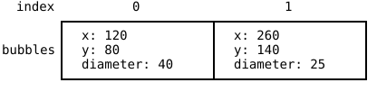

Three arrays for one soccer team, four for one screen full of
bubbles. Since the Arrays part you have been keeping several rows
in step by hand, and you have read the warnings that come with
that job. The soccer field chapter said that swapping two entries
in `lastNames` without swapping the first names sends player 1
onto the field as Lucas Rüdiger (@sec-parallel-arrays). The
bubbles chapter added a rule in a callout, push into all parallel
arrays together, because one forgotten push moves every color onto
the wrong circle from there on (@sec-bubble-arrays).

Both warnings exist for the same reason. Nothing you have written
so far can say "these values belong to one thing", so the
belonging lives in your discipline instead of in your code. This
chapter closes that gap. Afterwards a position is one value, a
bubble is one value, and that whole class of bug becomes
impossible to write. You also pick up something bigger than a bug
fix along the way, because you learn how to invent your own types.

## AI tutor {#sec-tutor-compound-types}

Rewriting a working program to use compound types feels different
from writing new code. You change one line, a dozen red squiggles
appear at once, and the program is broken for a few minutes on
purpose. That is normal, and the tutor is a good partner while it
lasts. Paste one squiggle together with the function it sits in
and ask what the type of that value should be now.



## Why compound types {#sec-why-compound}

Take a position on the canvas. It is two numbers, an x and a y,
and neither of them says anything on its own. An x of 10 fits
every point on a vertical line through the canvas, and only the y
next to it picks one of them. The two numbers describe one thing
and are useful only together.

Parallel arrays store such a thing by taking it apart. The x
values go into one row, the y values into another, and the only
thing tying them back together is the index. Nothing in the
program states that `circlesX[3]` and `circlesY[3]` describe the
same bubble. You know it, the compiler does not, and a rule the
compiler cannot check is a rule that breaks sooner or later.

A **compound type** is a type built out of several values, each
with a name of its own. Values that describe one thing then sit in
one place and travel together, so one variable is one position and
one element is one bubble. The connection between the x and the y
stops being a promise you keep and becomes part of the value.

## An object in one box {#sec-object-literal}

TypeScript writes a compound value as an **object**, a set of
named parts inside one pair of braces. Here is a position:

```typescript
let position: { x: number, y: number } = { x: 10, y: 20 };
```

Read the line in two halves. Everything between the colon and the
`=` is the type, and it lists which names the object has and what
each of them holds. Everything after the `=` is the value, and it
fills those names with 10 and 20. The named parts are called
**properties**, so this position has a property `x` and a property
`y`.

You reach a property with a dot. `position.x` is 10 and behaves
like any other number, so `circle(position.x, position.y, 20)`
draws a circle where the position says. A dot on the left of an
`=` writes instead of reads, as in `position.y = 50;`.

The console you met in the value-or-reference chapter
(@sec-console-log) is the magnifying glass for all of this. Open a
fresh sketch, type this program, and write on paper what you
expect on each of the three output lines before you press Run:

```typescript
function setup(): void {
    let position: { x: number, y: number } = { x: 10, y: 20 };
    position.y = 50;

    console.log(position.x);
    console.log(position.y);
    console.log(position);
}
```

Nothing is drawn here and the canvas stays empty, which is fine.
The first two lines show 10 and 50. The third one shows
`[object Object]`, and knowing that now saves you confusion later.
The output area turns every value it gets into text, and an object
has no useful text form of its own. An array does have one, which
is why logging a whole array printed `99,20,30` in the array
experiment (@sec-shared-reference). So log an object's properties
by name, and the magnifying glass works again.

**Vary it.** Delete `y: 20` from the value, so the braces hold
only `x: 10`, and watch the editor before you run anything. The
red squiggle says that the property `y` is missing. An object
either has everything its type promises or the program does not
compile, and that check is exactly what parallel arrays could
never give you. Put the `y` back.

## Objects are references {#sec-objects-are-references}

This section teaches no new rule. Objects behave exactly like the
arrays of the array experiment (@sec-shared-reference), and
running that experiment once more with an object is the fastest
way to see it. Replace the body of `setup`, and write your
prediction down first:

```typescript
const a: { x: number, y: number } = { x: 10, y: 20 };
const b: { x: number, y: number } = a;
b.x = 99;

console.log(a.x);
console.log(b.x);
```

The console shows 99 and 99. The box of `b` never held the object,
because an object is far too big for a variable box. The box holds
an arrow that says where the object lives. `const b = a` copies
what sits in a's box, which is the arrow, so afterwards two boxes
hold two arrows to one single object. `b.x = 99` follows an arrow
and changes the one object that exists, and `a.x` reads that same
property through the other arrow. Objects are **reference types**.

The `const` rule from the const puzzle (@sec-const-puzzle) carries
over word for word. `const` nails down the box, and the box holds
the arrow, so `const` means that this arrow never changes again.
Writing `b.x = 99` is allowed, because it never touches the arrow.
Adding this line is not:

```typescript
b = { x: 0, y: 0 };
```

The squiggle appears before you run anything, and it complains
about the variable, not about the object. Delete the line again.

A real copy of an object needs a brand new object, and here
objects are easier than arrays. Copying an array took a loop
(@sec-real-copy), because a loop is the only way to move an
unknown number of elements. An object has a fixed set of
properties whose names you know, so one line is enough:

```typescript
const copy: { x: number, y: number } = { x: a.x, y: a.y };
```

The braces build a new object with an arrow of its own, and each
property is filled with a number, a value type, so both values are
copied across. Two objects, two arrows, no connection. Add
`copy.x = 0;` below the line and log `a.x` and `copy.x` to watch
the two numbers go their separate ways.

::: {.callout-note}
## Comparing objects compares the arrows
`===` between two object variables asks whether the two boxes hold
the same arrow, just as it does for two array variables. Two
separate objects with the same property names and the same values
are still `false` under `===`, because they are two objects.
Comparing the contents means comparing the properties one by one,
for example with `a.x === copy.x && a.y === copy.y`.
:::

## Invent your own types: the type keyword {#sec-type-keyword}

Writing `{ x: number, y: number }` once is fine. Writing it as a
variable type, a parameter type, and a return type in the same
program is three chances to write it slightly differently, and the
better way carries a bigger idea with it.

Until this chapter, the set of types was fixed. `number`,
`boolean`, and `string` came with the language, arrays of them
came with the square brackets, and that was the whole list. The
`type` keyword lets you add to the list. You give a shape a name,
and from then on that name is a type like any other:

```typescript
type Position = { x: number, y: number };
```

The line belongs at the top of your file, next to the global
variables and outside every function. Type names start with a
capital letter, which is how a reader tells `Position` the type
from `position` the variable.

Your new type works in all three places a type can appear. In a
variable declaration:

```typescript
let target: Position = { x: 400, y: 300 };
```

As a parameter type, so a function takes a whole position instead
of two loose numbers:

```typescript
function drawMarker(p: Position): void {
    circle(p.x, p.y, 20);
}
```

And as a return type, which closes a loose end from the target
game. That chapter had to warn you that a function returns one
value and not two, so a position finder either hands back a
`number[]` or gets split into two functions (@sec-target-positions).
With `Position` in the language, a random position is one value:

```typescript
function randomPosition(): Position {
    return { x: random(width), y: random(height) };
}
```

The `return` builds a fresh object right there and hands it back,
so the caller keeps a whole position in one variable with
`const p: Position = randomPosition();`. The rule that a function
returns one value has not changed at all. You widened what one
value can be.

## Arrays of compound types {#sec-array-of-objects}

A bubble in Bubble Buster is a position and a size, so it takes
three numbers, and a type of its own says so:

```typescript
type Bubble = { x: number, y: number, diameter: number };
```

Once `Bubble` exists, `Bubble[]` is a type too, a row of bubbles,
and the whole game state becomes one array:

```typescript
const bubbles: Bubble[] = [];
```

{width=460}

Every operation the game needs gets shorter. Creating a bubble is
one push of one object instead of three pushes into three arrays:

```typescript
bubbles.push({
    x: random(width),
    y: random(height),
    diameter: random(10, 50)
});
```

Removing a bubble is one `splice` instead of three, because
`bubbles.splice(i, 1);` takes the whole bubble out. Drawing walks
the single array, with `bubbles[i]` as the whole bubble and a dot
for the part you want:

```typescript
for (let i: number = 0; i < bubbles.length; i++) {
    circle(bubbles[i].x, bubbles[i].y, bubbles[i].diameter);
}
```

Read `bubbles[i].x` from left to right, element i of `bubbles`,
then its `x`. And `bubbles.length` counts bubbles now, not
numbers. No second array can fall out of step with the first,
because there is no second array.

## Your exercise: Bubble Buster, rebuilt {#sec-compound-types-exercise}

This chapter brings no new exercise. You reopen Bubble Buster
(@sec-bubble-buster-exercise) and rebuild its engine on one array
of objects, starting from your own working solution. If your
solution never got finished, paste the sample solution of that
exercise into the playground and work on that instead.

What you are doing has a name. A **refactoring** is a rewrite that
changes how a program is built without changing what it does. Work
through the tasks in order and run the game after each one.

1. **Task 1: the type.** Add `type Bubble` at the top of the file,
   with the three properties `x`, `y`, and `diameter`, all of them
   `number`.
2. **Task 2: one array.** Replace `circlesX`, `circlesY`, and
   `circlesDiameter` with `const bubbles: Bubble[] = [];`. Every
   line that used the old arrays now shows a squiggle, so fix them
   one at a time, including the drawing loop in `draw` and the
   game over check, which becomes `bubbles.length >= 10`.
3. **Task 3: one push.** Rewrite `addRandomCircle` so it pushes a
   single object with all three properties filled in, instead of
   pushing three numbers into three separate arrays.
4. **Task 4: one splice.** In `mouseClicked`, the backwards loop
   stays exactly as it is, because a loop that removes elements
   from the array it walks always has to go backwards
   (@sec-splice). Only the removal changes, from three `splice`
   calls to one.
5. **Task 5: a bubble instead of an index.** Change `isInside` so
   its third parameter is a `Bubble` instead of an index, and read
   the center and the diameter from that parameter. The Bubble
   Buster chapter had to explain that index parameter and why the
   bubble data stayed behind in the arrays (@sec-bubble-hit-test),
   and with a compound type the explanation disappears. The call
   turns into `isInside(mouseX, mouseY, bubbles[i])`.

You are done when the game plays exactly as before. Same bubbles,
same popping, same score, same game over screen, and far fewer
ways for the program to break.



## Check your understanding {#sec-quiz-compound-types}

When your Bubble Buster runs on one array of bubbles and you can
say out loud what `type Bubble` gave the program, take the short
quiz below. You answer six questions about this chapter in your
own words, and an AI reads your answers and tells you what you
already understand and what you should read again. The quiz is
anonymous, and answering in German is fine too.


